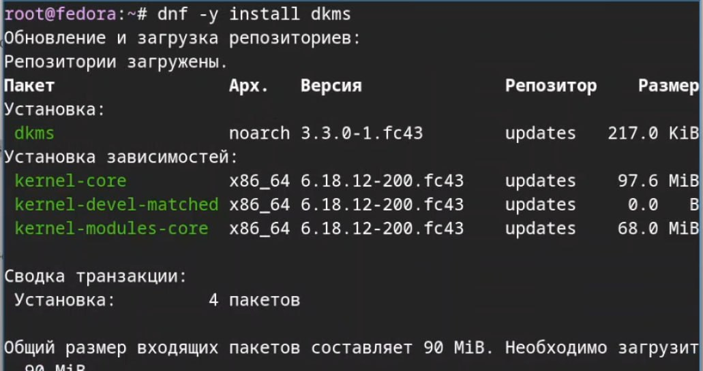
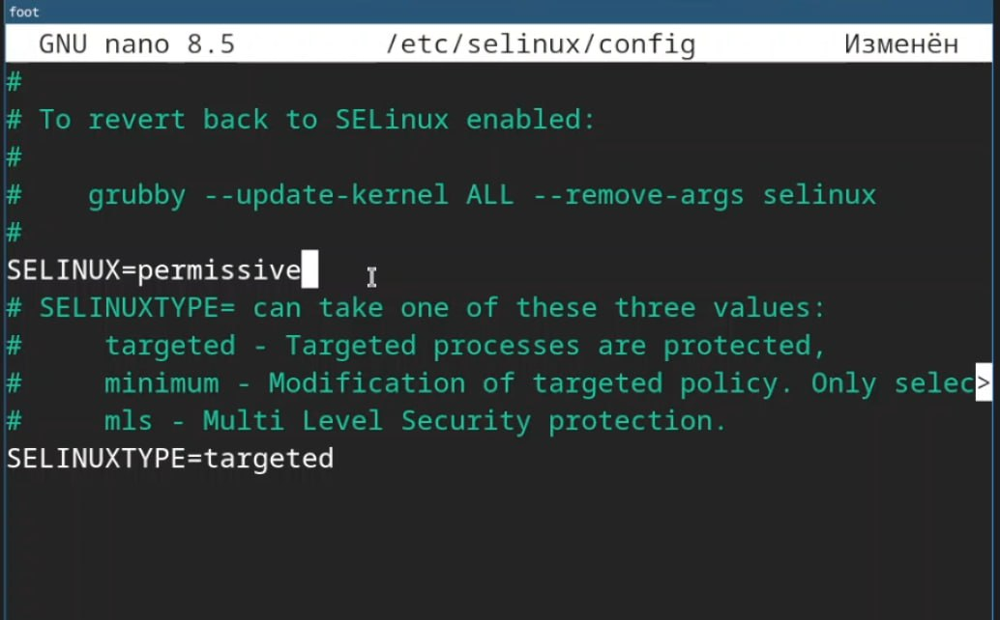
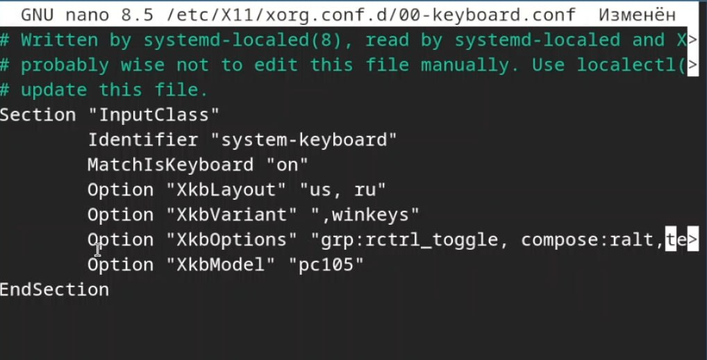
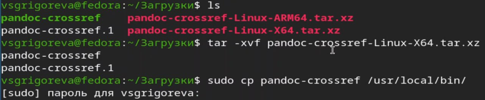
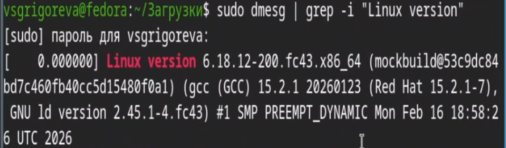

---
## Front matter
lang: ru-RU
title: Лабораторная работа №1
subtitle: Операционные системы
author:
  - Григорьева Валерия Сергеевна
institute:
  - Российский университет дружбы народов, Москва, Россия
date: 04 марта 2026

## i18n babel
babel-lang: russian
babel-otherlangs: english

## Formatting pdf
toc: false
toc-title: Содержание
slide_level: 2
aspectratio: 169
section-titles: true
theme: metropolis
header-includes:
 - \metroset{progressbar=frametitle,sectionpage=progressbar,numbering=fraction}
---

# Информация

## Докладчик

:::::::::::::: {.columns align=center}
::: {.column width="70%"}

* Григорьева Валерия Сергеевна
* студентка НКАбд-02-25
* Российский университет дружбы народов им. П. Лумумбы
* 1032253494@rudn.ru

:::
::: {.column width="30%"}

:::
::::::::::::::

## Цель работы

Целью данной работы является приобретение практических навыков установки операционной системы на виртуальную машину, и ее настройка для дальнейшей работы сервисов.

## Задание

- Установка операционной системы на VirtualBox.
- Настройка ОС для работы.
- Установка необходимого ПО.

## Теоретическое введение

Лабораторная работа подразумевает установку на виртуальную машину VirtualBox операционной системы Linux (дистрибутив Fedora), вариант с менеджером окон sway.

# Выполнение лабораторной работы

## 

Для начала работы я создала новую Fedora на виртуальной машине VirtualBox. Указала все необходимые настройки при создании, а затем в настройках ВМ. Далее запустила Fedora и установила ее на диск.

Далее я установила пакет DKMS, драйвер, добавила своего пользователя в группу vboxsf. Затем в хостовой системе подключила разделяемую папку.

# Настройка

##

Переключившись на супер-пользовтеля, я установила средства разработки, ПО для автоматического обновления, обновила все пакеты.

## 

Далее я отключила SELinux.

##

Затем настроила раскладку клавиатуры. 

## 

Установила средство pandoc для работы с языком разметки Markdown, а затем пакет pandoc-crossref и TeXlive.

{#fig-017 width=70%}

## Домашнее задание

Проанализировала последовательность загрузки системы, выполнив команду dmesg с помощью grep: dmesg | grep -i "то, что ищем". Получила информацию о версии ядра Linux (Linux version), частоте, модели процессора, объеме доступной памяти и др.

## Выводы

В ходе выполнения лабораторной работы приобрела навыки установки Fedora Sway на VirtualBox, установила ряд нужных пакетов и настроила ОС для дальнейшей работы на ней.

