---
## Author
author:
  name: Валерия Сергеевна Григорьева
  degrees: DSc
  orcid: 0000-0002-0877-7063
  email: 1032253494@rudn.ru
  affiliation:
    - name: Российский университет дружбы народов
      country: Российская Федерация
      postal-code: 117198
      city: Москва
      address: ул. Миклухо-Маклая, д. 6

## Title
title: "Лабораторная работа №1"
subtitle: "дисциплина: Архитектура компьютера"
license: "CC BY"
---

# Цель работы

Целью данной работы является приобретение практических навыков установки операционной системы на виртуальную машину, и ее настройка для дальнейшей работы сервисов.

# Задание

- Установка операционной системы на VirtualBox.
- Настройка ОС для работы.
- Установка необходимого ПО.

# Теоретическое введение

Лабораторная работа подразумевает установку на виртуальную машину VirtualBox операционной системы Linux (дистрибутив Fedora), вариант с менеджером окон sway.

# Выполнение лабораторной работы

## Установка Fedora Sway на VirtualBox

Для начала работы я создала новую Fedor'у на виртуальной машине VirtualBox ([рис. @fig-001]). Указала все необходимые настройки при создании (логин, размер основной памяти ВМ, размер диска — 80 ГБ), а затем в настройках ВМ (графический контроллер - VMSVGA, 3D ускорение, поддержка UEFI).

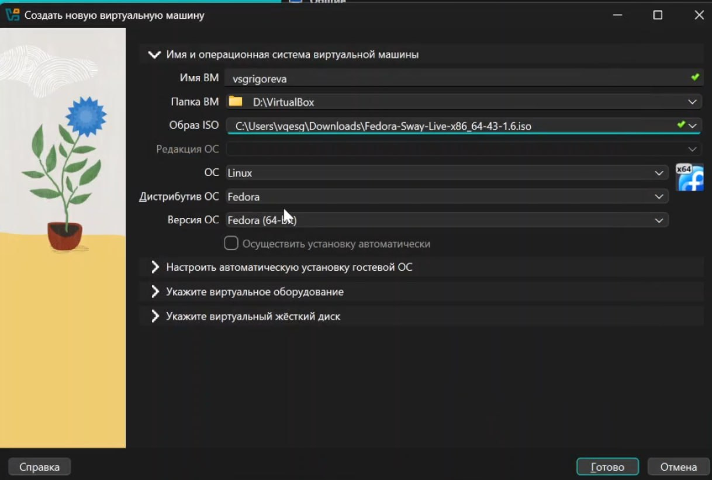{#fig-001 width=70%}

Затем я запустила Fedora в режиме базовой графики, в предложенном окне ввела liveinst, и установила Fedora на диск, при этом выбрав язык, часовой пояс, раскладку клавиатуры, установив имя и пароль для обычного и root пользователей. Затем перезапустила Fedora и отмонтировала диск iso.

Далее я вклюсила Fedora, открыла терминал, нажав на Win+Enter, и установила нужные пакеты. Для последнего необходимо было запустить терминальный мультиплексор tmux, переключиться на роль супер-пользователя и установить средство разработки ([рис. @fig-002]). 

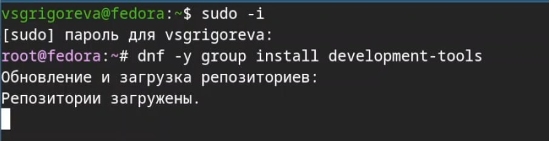{#fig-002 width=70%}

Далее я установила пакет DKMS ([рис. @fig-003]). 

{#fig-003 width=70%}

Далее я в меню виртуальной машины подключила образ диска дополнений гостевой ОС, подмонтировала его, а затем установила драйвер и перезагрузила ВМ ([рис. @fig-004]).

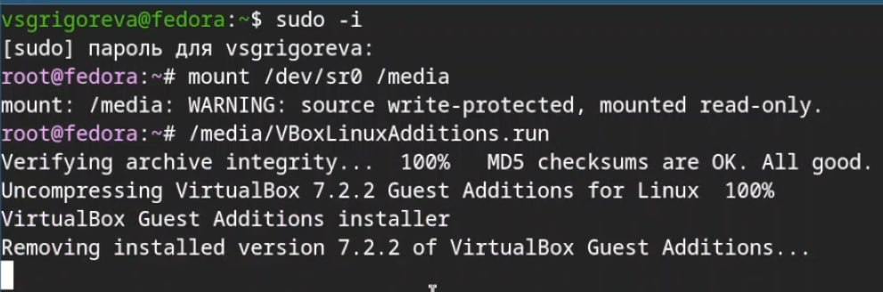{#fig-004 width=70%}

Далее я внутри виртуальной машины добавила своего пользователя в группу vboxsf ([рис. @fig-005]).

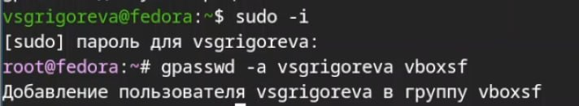{#fig-005 width=70%}

Затем в хостовой системе подключила разделяемую папку ([рис. @fig-006]) и перезагрузила ВМ.

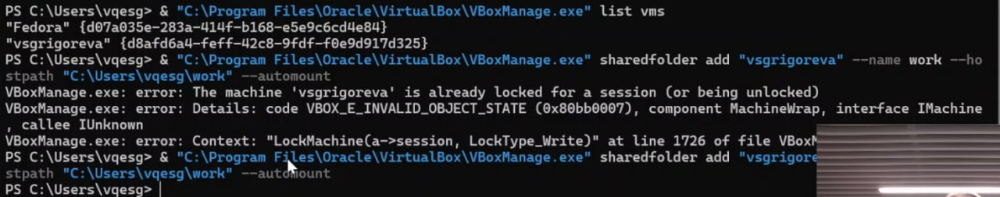{#fig-006 width=70%}

## Настройка 

Переключившись на супер-пользовтеля, я установила средства разработки ([рис. @fig-007]).

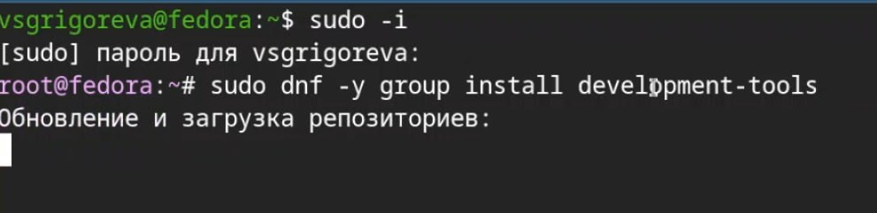{#fig-007 width=70%}

Далее я обновила все пакеты ([рис. @fig-008]).

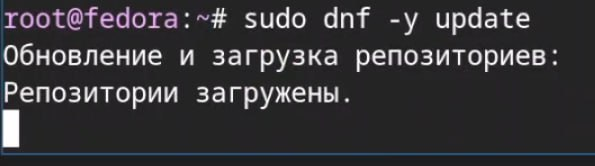{#fig-008 width=70%}

Для удобства работы в консоли установила необходимую программу ([рис. @fig-009]).

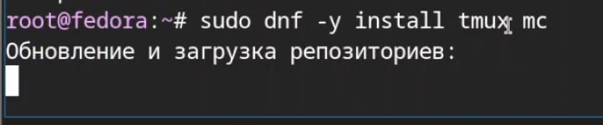{#fig-009 width=70%}

Далее установила ПО для автоматического обновления ([рис. @fig-010]) и запустила таймер ([рис. @fig-011]).

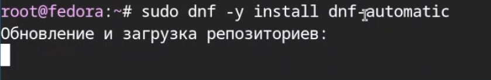{#fig-010 width=70%}

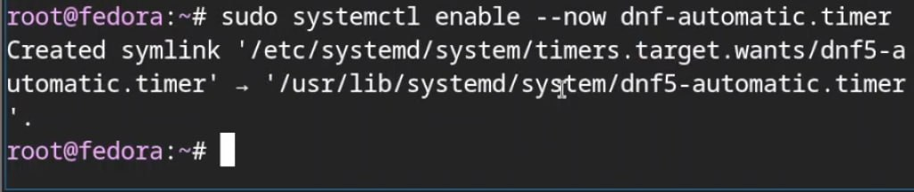{#fig-0 width=70%}

Далее я отключила SELinux. Для этого в файле /etc/selinux/config заменила значение SELINUX=enforcing на значение SELINUX=permissive ([рис. @fig-012]).

{#fig-012 width=70%}

Затем перезагрузила ВМ ([рис. @fig-013]).

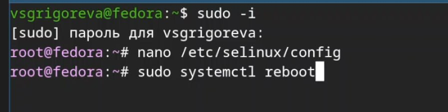{#fig-013 width=70%}

Затем для настройки раскладки клавиатуры создала конфигурационный файл ~/.config/sway/config.d/95-system-keyboard-config.conf и отредактировала конфигурационный файл ~/.config/sway/config.d/95-system-keyboard-config.conf ([рис. @fig-014]), написав туда exec_always /usr/libexec/sway-systemd/locale1-xkb-config --oneshot. Далее я отредактировала конфигурационный файл /etc/X11/xorg.conf.d/00-keyboard.conf ([рис. @fig-015]). После этого я перезагрузила ВМ.

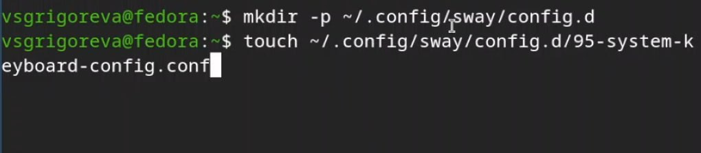{#fig-014 width=70%}

{#fig-015 width=70%}

Так как при установке я указала правильное имя пользователя и название хоста, через терминал ничего не меняла.

## Установка программного обеспечения для создания документации

Для начала я установила средство pandoc для работы с языком разметки Markdown ([рис. @fig-016]), а затем пакет pandoc-crossref ([рис. @fig-017]).

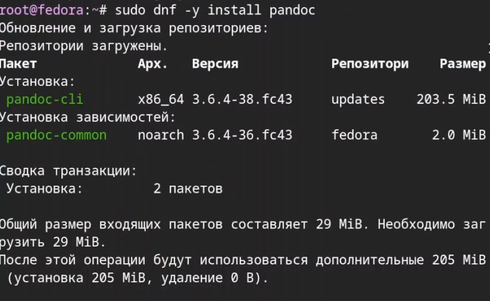{#fig-016 width=70%}

{#fig-017 width=70%}

Далее я проверила, что все установилось ([рис. @fig-018]).

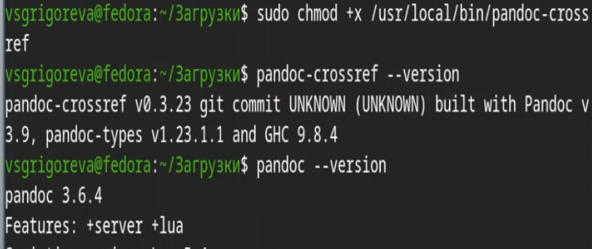{#fig-018 width=70%}

Затем с помощью команды sudo dnf -y install texlive-scheme-full установила TeXlive ([рис. @fig-019]).

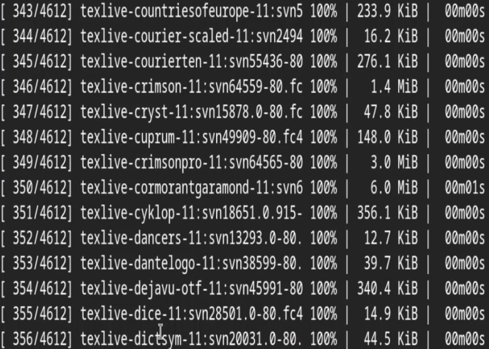{#fig-019 width=70%}

## Домашнее задание

Проанализировала последовательность загрузки системы, выполнив команду dmesg с помощью grep: dmesg | grep -i "то, что ищем"

Получила следующую информацию: 

Версия ядра Linux (Linux version) ([рис. @fig-020]).

{#fig-020 width=70%}

Частота процессора (Detected Mhz processor) ([рис. @fig-021]).

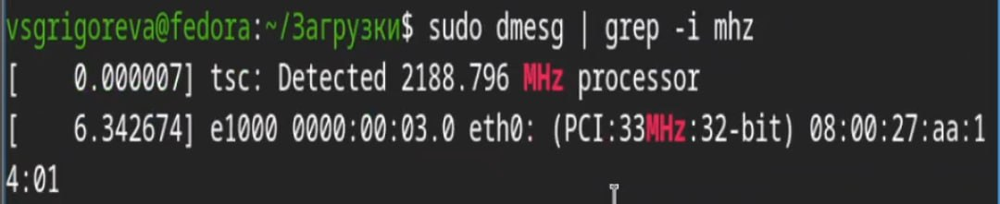{#fig-021 width=70%}

Модель процессора (CPU0) ([рис. @fig-022]).

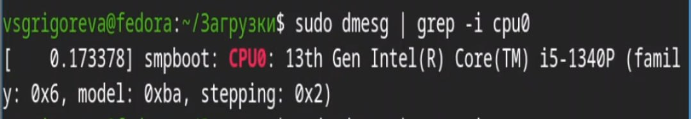{#fig-022 width=70%}

Объём доступной оперативной памяти (Memory available) ([рис. @fig-023]).

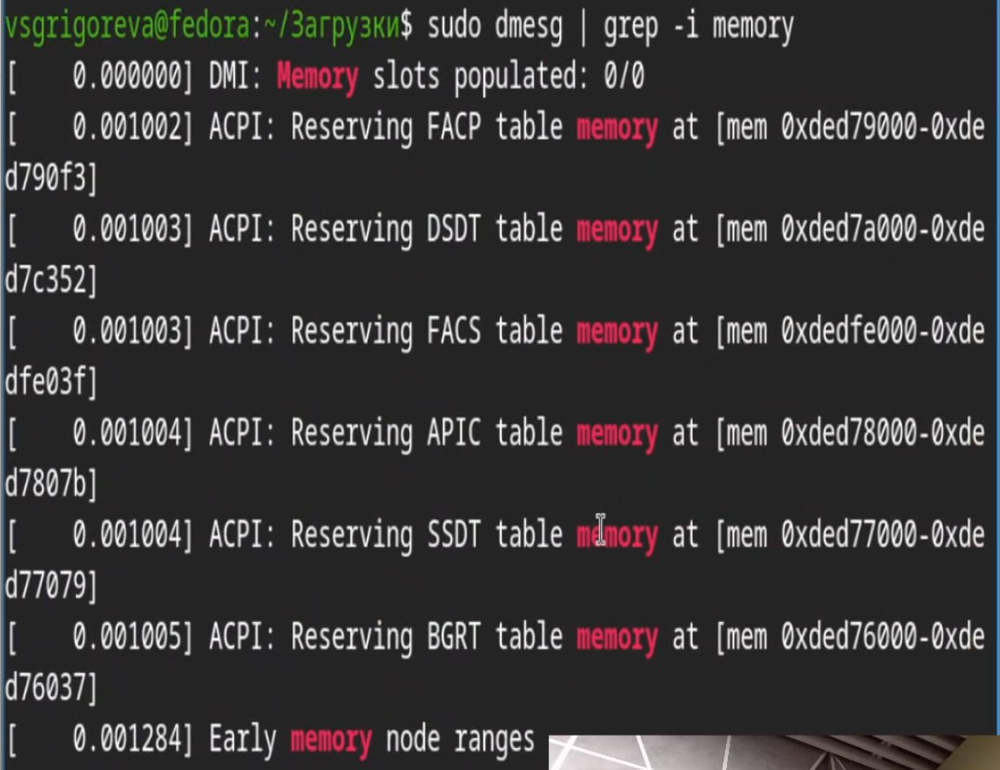{#fig-023 width=70%}

Тип обнаруженного гипервизора (Hypervisor detected) ([рис. @fig-024]).

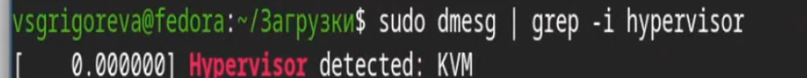{#fig-024 width=70%}
        
Тип файловой системы корневого раздела и последовательность монтирования файловых систем ([рис. @fig-025]).

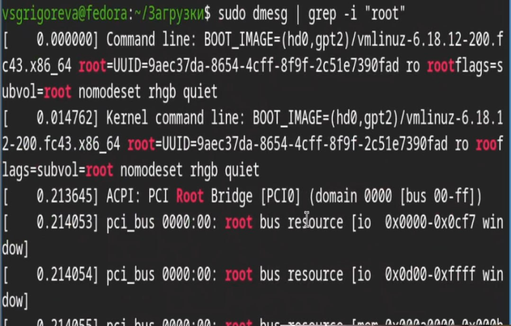{#fig-025 width=70%}

# Выводы

В ходе выполнения лабораторной работы приобрела навыки установки Fedora Sway на VirtualBox, установила ряд нужных пакетов и настроила ОС для дальнейшей работы на ней.

# Список литературы{.unnumbered}

::: {#refs}
:::
