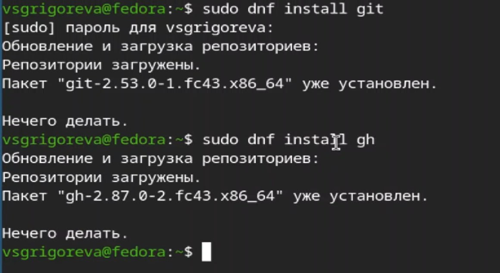
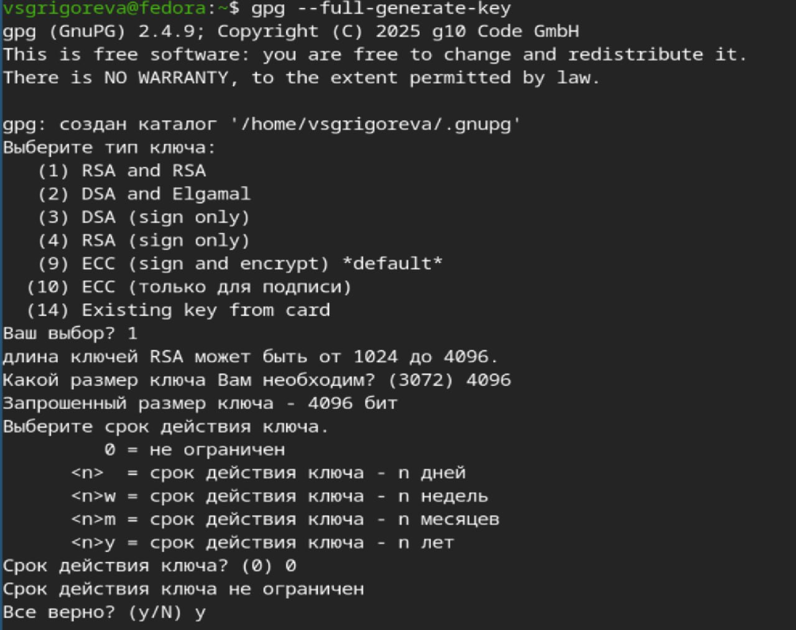

---
## Front matter
lang: ru-RU
title: Лабораторная работа №2
subtitle: Операционные системы
author:
  - Григорьева Валерия Сергеевна
institute:
  - Российский университет дружбы народов, Москва, Россия
date: 04 марта 2026

## i18n babel
babel-lang: russian
babel-otherlangs: english

## Formatting pdf
toc: false
toc-title: Содержание
slide_level: 2
aspectratio: 169
section-titles: true
theme: metropolis
header-includes:
 - \metroset{progressbar=frametitle,sectionpage=progressbar,numbering=fraction}
---

# Информация

## Докладчик

:::::::::::::: {.columns align=center}
::: {.column width="70%"}

  * Григорьева Валерия Сергеевна
  * студентка НКАбд-02-25
  * Российский университет дружбы народов им. П. Лумумбы
  * [1032253494@rudn.ru](mailto:1032253494@rudn.ru)

:::
::: {.column width="30%"}

:::
::::::::::::::

## Цель работы

ЦЦелью работы было изучить идеологию и применение средств контроля версий, а также освоить умения по работе с git.

## Задание

- Создать базовую конфигурацию для работы с git.
- Создать ключ SSH.
- Создать ключ PGP.
- Настроить подписи git.
- Зарегистрироваться на Github.
- Создать локальный каталог для выполнения заданий по предмету.

## Теоретическое введение

Системы контроля версий (Version Control System, VCS) применяются при работе нескольких человек над одним проектом. Обычно основное дерево проекта хранится в локальном или удалённом репозитории, к которому настроен доступ для участников проекта. При внесении изменений в содержание проекта система контроля версий позволяет их фиксировать, совмещать изменения, произведённые разными участниками проекта, производить откат к любой более ранней версии проекта, если это требуется.

В классических системах контроля версий используется централизованная модель, предполагающая наличие единого репозитория для хранения файлов. Выполнение большинства функций по управлению версиями осуществляется специальным сервером. 

# Выполнение лабораторной работы

## Установка git и gh

Для начала работы я устновила git и gh. Затем я настроила git: зададала имя и email владельца репозитория, настроила utf-8 в выводе сообщений git и т.д.

## Создание ssh и pgp ключей

Затем создала ключи ssh: по алгоритму rsa с ключём размером 4096 бит и по алгоритму ed25519. Далее создала ключ pgp и добавила его в github.

## Настройка подписей коммитов и gh

Далее настроила автоматические подписи коммитов git и настроила gh. 

## Создание репозитория курса

Далее я создала репозиторий курса на основе шаблона, а затем клонировала его к себе на компьютер.

## Настройка каталога курса

Затем начала настройку каталога курса: удалила лишние файлы, создала необходимые каталоги.

## Отправка файлов на github

Далее отправила все файлы на сервер.

## Выводы

В ходе лабораторной работы я приобрела необходимые навыки для работы с git, научилась создавать репозитории на основе шаблона, gpg и ssh ключи, настроила каталог курса.
