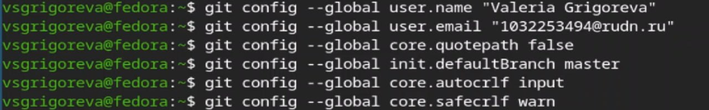
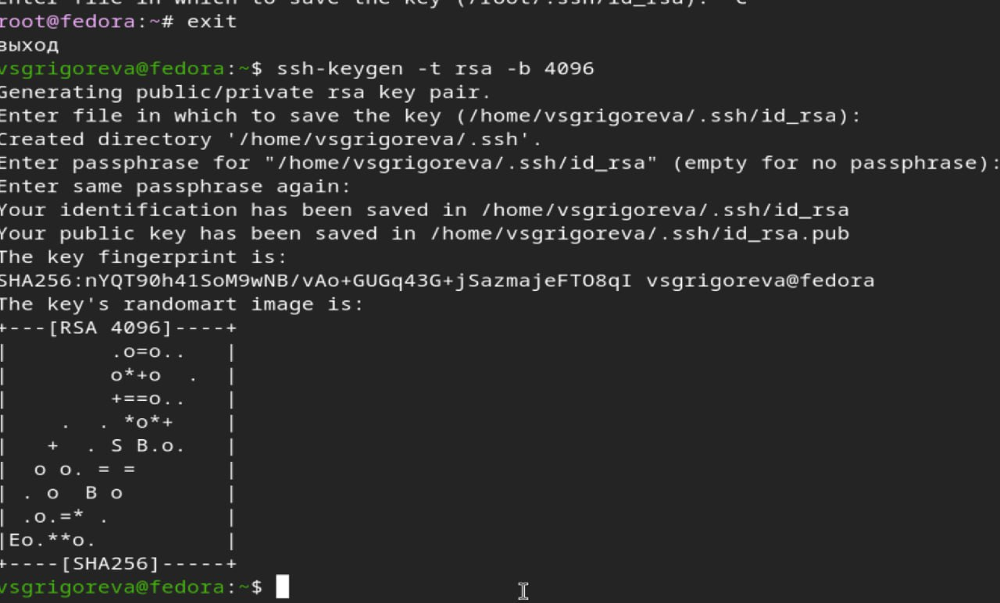
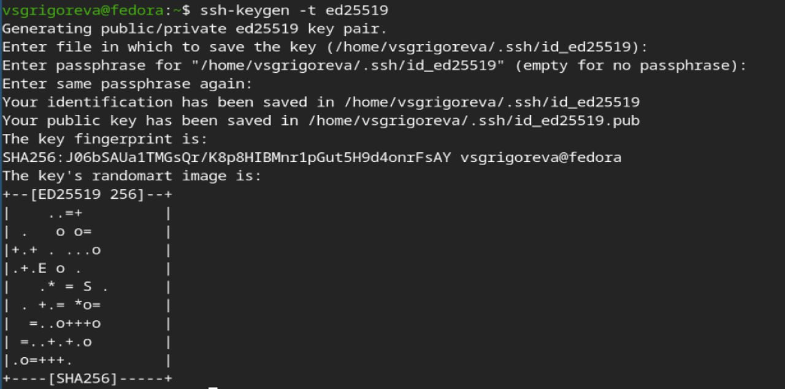
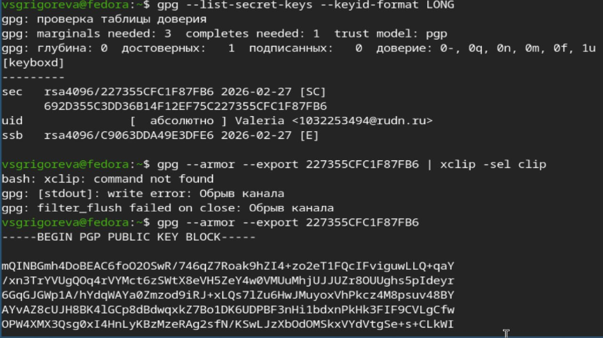
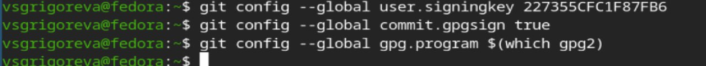
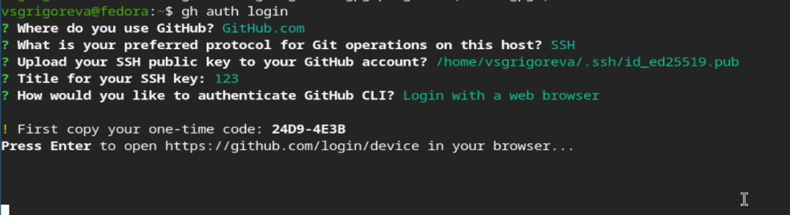
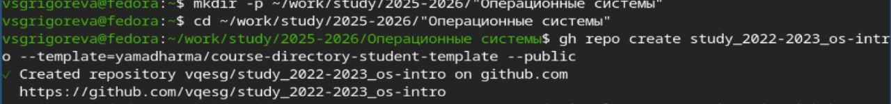
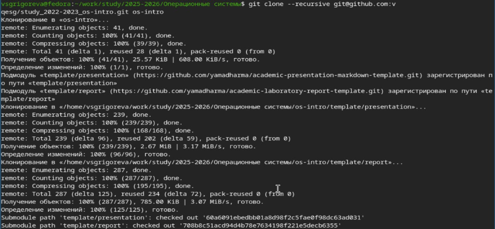
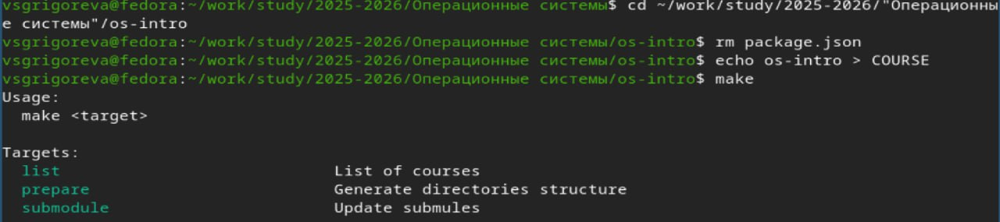
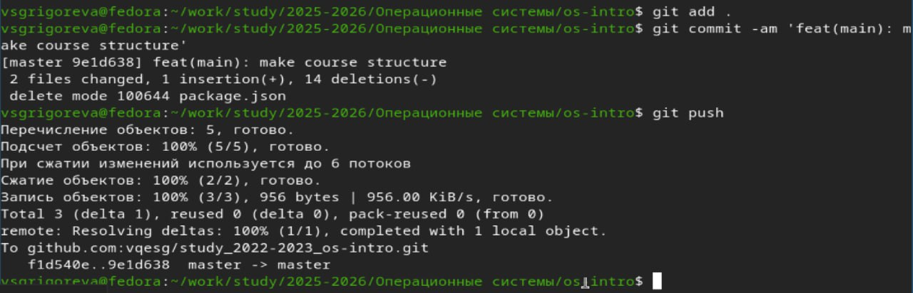

---
## Author
author:
  name: Валерия Сергеевна Григорьева
  degrees: DSc
  orcid: 0000-0002-0877-7063
  email: 1032253494@rudn.ru
  affiliation:
    - name: Российский университет дружбы народов
      country: Российская Федерация
      postal-code: 117198
      city: Москва
      address: ул. Миклухо-Маклая, д. 6

## Title
title: "Лабораторная работа №2"
subtitle: "дисциплина: Архитектура компьютеров"
license: "CC BY"
---

# Цель работы

Целью работы было изучить идеологию и применение средств контроля версий, а также освоить умения по работе с git.

# Задание

Необходимо было: 
- Создать базовую конфигурацию для работы с git.
- Создать ключ SSH.
- Создать ключ PGP.
- Настроить подписи git.
- Зарегистрироваться на Github.
- Создать локальный каталог для выполнения заданий по предмету.

# Теоретическое введение

Системы контроля версий (Version Control System, VCS) применяются при работе нескольких человек над одним проектом. Обычно основное дерево проекта хранится в локальном или удалённом репозитории, к которому настроен доступ для участников проекта. При внесении изменений в содержание проекта система контроля версий позволяет их фиксировать, совмещать изменения, произведённые разными участниками проекта, производить откат к любой более ранней версии проекта, если это требуется.

В классических системах контроля версий используется централизованная модель, предполагающая наличие единого репозитория для хранения файлов. Выполнение большинства функций по управлению версиями осуществляется специальным сервером. Участник проекта (пользователь) перед началом работы посредством определённых команд получает нужную ему версию файлов. После внесения изменений, пользователь размещает новую версию в хранилище. При этом предыдущие версии не удаляются из центрального хранилища и к ним можно вернуться в любой момент. Сервер может сохранять не полную версию изменённых файлов, а производить так называемую дельта-компрессию — сохранять только изменения между последовательными версиями, что позволяет уменьшить объём хранимых данных.

Системы контроля версий поддерживают возможность отслеживания и разрешения конфликтов, которые могут возникнуть при работе нескольких человек над одним файлом. Можно объединить (слить) изменения, сделанные разными участниками (автоматически или вручную), вручную выбрать нужную версию, отменить изменения вовсе или заблокировать файлы для изменения. В зависимости от настроек блокировка не позволяет другим пользователям получить рабочую копию или препятствует изменению рабочей копии файла средствами файловой системы ОС, обеспечивая таким образом, привилегированный доступ только одному пользователю, работающему с файлом.

Среди классических VCS наиболее известны CVS, Subversion, а среди распределённых — Git, Bazaar, Mercurial. Принципы их работы схожи, отличаются они в основном синтаксисом используемых в работе команд.

Система контроля версий Git представляет собой набор программ командной строки. Доступ к ним можно получить из терминала посредством ввода команды git с различными опциями. Благодаря тому, что Git является распределённой системой контроля версий, резервную копию локального хранилища можно сделать простым копированием или архивацией.

# Выполнение лабораторной работы

Для начала работы я устновила git и gh ([рис. @fig-001]).

{#fig-001 width=70%}

Далее я настроила git (зададала имя и email владельца репозитория, настроила utf-8 в выводе сообщений git, задала имя начальной ветки (master), установила параметр autocrlf, параметр safecrlf) ([рис. @fig-002]).

{#fig-002 width=70%}

Затем создала ключи ssh: по алгоритму rsa с ключём размером 4096 бит ([рис. @fig-003])

{#fig-003 width=70%}

и по алгоритму ed25519 ([рис. @fig-004]).

{#fig-004 width=70%}

Далее создала ключи pgp ([рис. @fig-005]).

{#fig-005 width=70%}

Затем необходимло было добавить PGP ключ в GitHub. Для этого вывела список ключей и скопировала отпечаток приватного ключа, скопировала его ([рис. @fig-006]) и в гитхабе добавила этот ключ с помощью кнопки New GPG key.

{#fig-006 width=70%}

Далее настроила автоматические подписи коммитов git ([рис. @fig-007]).

{#fig-007 width=70%}

Затем настроила gh ([рис. @fig-008]).

{#fig-008 width=70%}

Далее я создала репозиторий курса на основе шаблона ([рис. @fig-009]).

{#fig-009 width=70%}

Затем клонировала репозиторий к себе на компьютер ([рис. @fig-010]).

{#fig-010 width=70%}

Затем начала настройку каталога курса: удалила лишние файлы, создала необходимые каталоги ([рис. @fig-011]).

{#fig-011 width=70%}

Далее отправила все файлы на сервер ([рис. @fig-012]).

{#fig-012 width=70%}

# Выводы

В ходе лабораторной работы я приобрела необходимые навыки для работы с git, научилась создавать репозитории на основе шаблона, gpg и ssh ключи, настроила каталог курса.

# Ответы на контрольные вопросы

- Что такое системы контроля версий (VCS) и для решения каких задач они предназначаются?

VCS — система контроля версий для работы нескольких человек над проектом. Позволяет: фиксировать изменения, объединять правки разных участников, откатываться к предыдущим версиям, отслеживать кто, когда и что изменил.

- Объясните следующие понятия VCS и их отношения: хранилище, commit, история, рабочая копия.

Хранилище (репозиторий) — место, где хранится проект и вся история изменений. Commit — зафиксированное изменение (новая версия проекта). История — последовательность всех commit. Рабочая копия — файлы, с которыми пользователь работает локально.

Изменения → commit → сохраняются в репозитории → формируют историю.

- Что представляют собой и чем отличаются централизованные и децентрализованные VCS? Приведите примеры VCS каждого вида.

Централизованные — один центральный репозиторий, сервер управляет версиями (CVS, Subversion). Распределённые — у каждого полная копия репозитория, центральный сервер не обязателен (Git, Mercurial, Bazaar).

- Опишите действия с VCS при единоличной работе с хранилищем.

Изменить файлы. git add — добавить изменения. git commit — сохранить. При необходимости git push — отправить на сервер.

- Опишите порядок работы с общим хранилищем VCS.

git pull — получить изменения. Создать ветку. Внести изменения. git add, git commit. git push — отправить в центральный репозиторий. При необходимости — слияние (git merge) и решение конфликтов.

- Каковы основные задачи, решаемые инструментальным средством git?

Хранение истории изменений, совмещение правок, работа с ветками, совместная разработка, резервное копирование проекта.

- Назовите и дайте краткую характеристику командам git.

git init — создать репозиторий

git status — состояние файлов

git diff — показать изменения

git add — добавить изменения

git commit — зафиксировать изменения

git pull — получить изменения

git push — отправить изменения

git branch — работа с ветками

git merge — слияние веток

git checkout — переключение веток

- Приведите примеры использования при работе с локальным и удалённым репозиториями.

Локально:
git init
git add .
git commit -am "Комментарий"

С удалённым репозиторием:
git pull
git push origin имя_ветки

- Что такое и зачем могут быть нужны ветви (branches)?

Ветви (branches) — параллельные версии проекта. Нужны для разработки новых функций и исправлений без влияния на основную версию.

- Как и зачем можно игнорировать некоторые файлы при commit?

Используется файл .gitignore. В нём указываются временные, служебные или скомпилированные файлы, которые не нужно добавлять в репозиторий.

# Список литературы{.unnumbered}

::: {#refs}
:::
