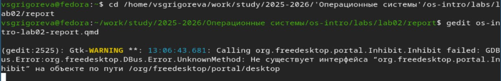
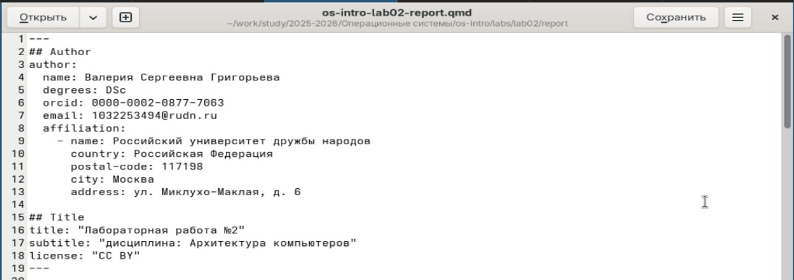
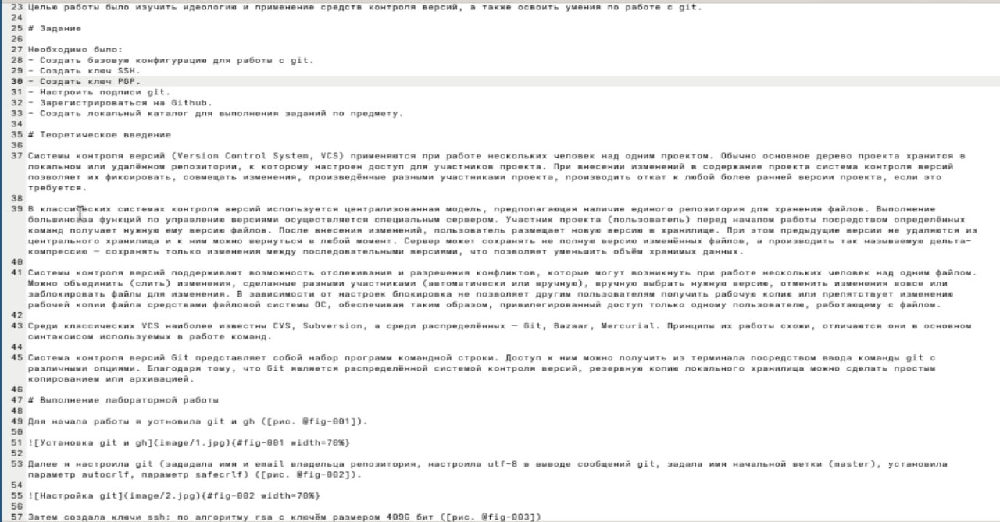
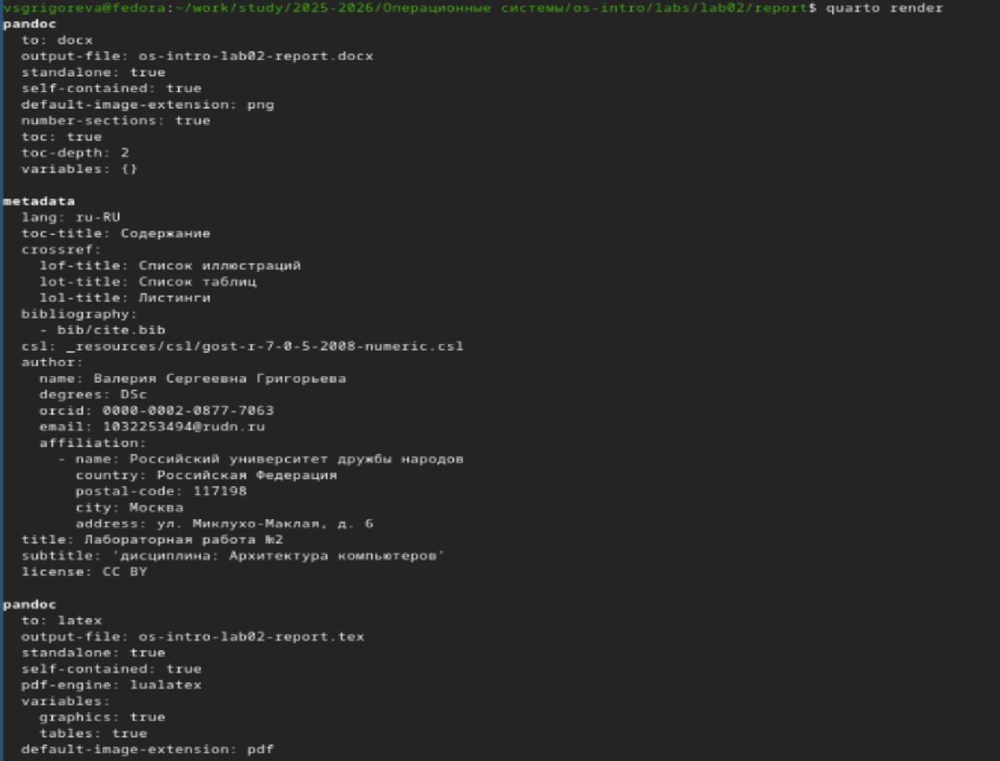
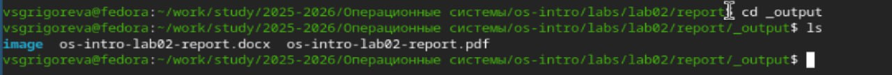

---
## Author
author:
  name: Валерия Сергеевна Григорьева
  degrees: DSc
  orcid: 0000-0002-0877-7063
  email: 1032253494@rudn.ru
  affiliation:
    - name: Российский университет дружбы народов
      country: Российская Федерация
      postal-code: 117198
      city: Москва
      address: ул. Миклухо-Маклая, д. 6

## Title
title: "Лабораторная работа №3"
subtitle: "дисциплина: Архитектура компьютеров"
license: "CC BY"
---

# Цель работы

Целью данной работы было научиться оформлять отчёты с помощью легковесного языка разметки Markdown.

# Задание

Необходимо было сделать отчёт по предыдущей лабораторной работе в формате Markdown. В качестве отчёта просьба предоставить отчёты в 3 форматах: pdf, docx и md (в архиве, поскольку он должен содержать скриншоты, Makefile и т.д).

# Теоретическое введение

Markdown — облегчённый язык разметки для форматирования текста.

Основные элементы синтаксиса:

Заголовки создаются с помощью символа #.

Для того, чтобы написать текст курсивом, нужно на границах текста поставить *:

Курсив — *текст*

Для полужирного курсива необходимо поставит ***: 

Полужирный курсив — ***текст***

Цитата оформляется символом >:

> Текст цитаты

Маркированный список оформляется символом -:

- Пункт 1
- Пункт 2

Нумерованный список нужно обозначать цифрами:

1. Пункт 1
2. Пункт 2

Ссылки: [текст ссылки](адрес)

Встроенный код выделяется обратными кавычками:

'''
код

'''

Верхний (обозначается ~) и нижний (обозначается ^) индексы: 
H~2~O
2^10^

Формулы записываются в стиле LaTeX:

Для преобразования Markdown-файлов используется программа Pandoc.

Примеры преобразования:

pandoc README.md -o README.pdf

pandoc README.md -o README.docx

Для автоматизации сборки можно использовать Makefile, который позволяет автоматически создавать файлы .pdf и .docx из .md.

# Выполнение лабораторной работы

Для начала работы я установила quarto, gedit и затем открыла файл с шаблоном отчета в gedit ([рис. @fig-001]).

{#fig-001 width=70%}

Затем я изменила шапку шаблона, записав в нее свои данные ([рис. @fig-002]).

{#fig-002 width=70%}

Далее я начала писать отчет, заполнила цель, задание, теоретическое введение, выполнение лабораторной работы, контрольные вопросы, выводы, вставляя в отчет скриншоты ([рис. @fig-003]).

{#fig-003 width=70%}

Когда отчет был готов, сохранила его и закрыла. С помощью команы quarto render создала файлы отчета форматов .docx и .pdf ([рис. @fig-004]).

{#fig-004 width=70%}

Затем я проверила, что нужные файлы были созданы ([рис. @fig-005]).

{#fig-005 width=70%}

# Выводы

В процессе выполнения лабораторной работы я научилась создавать отчеты с помощью легковесного языка разметки Markdown.

# Список литературы{.unnumbered}

::: {#refs}
:::
