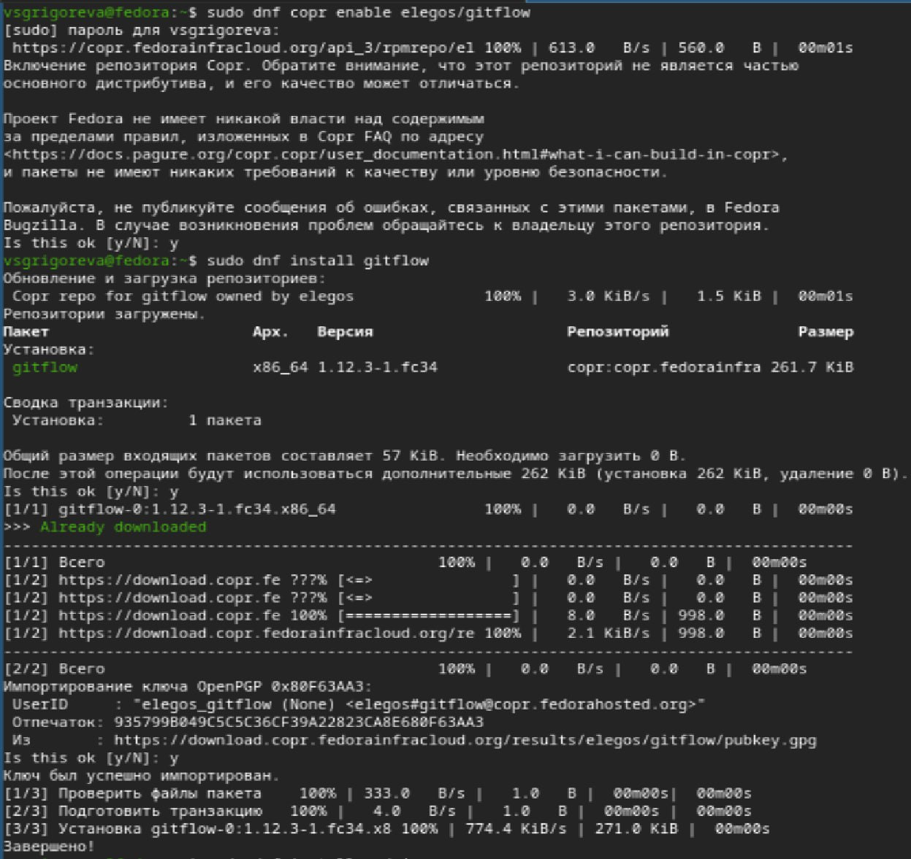
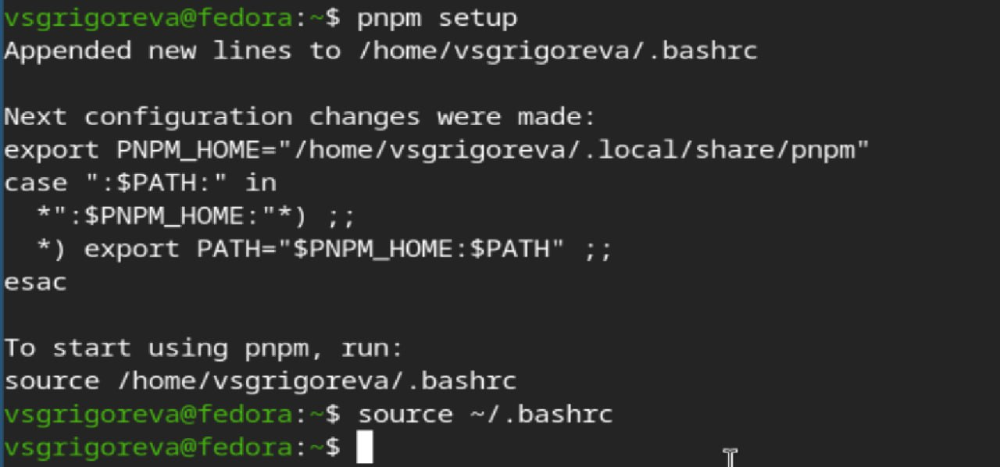
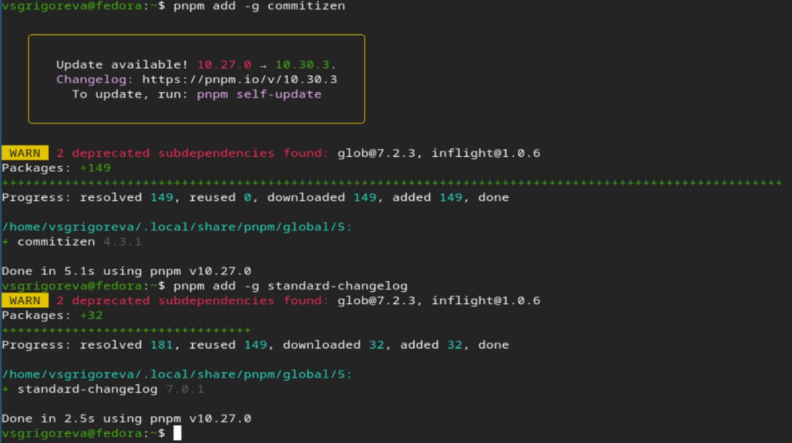
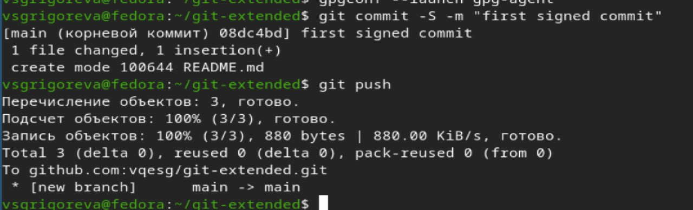
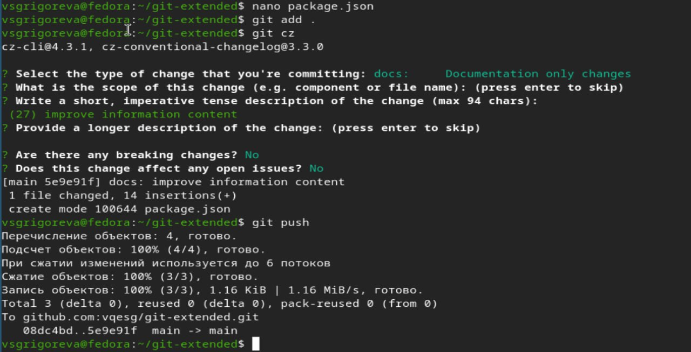
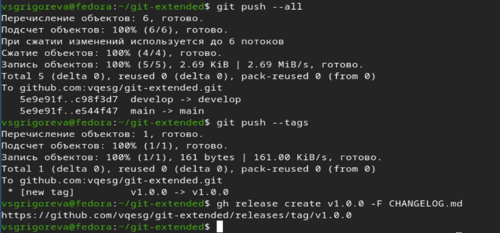
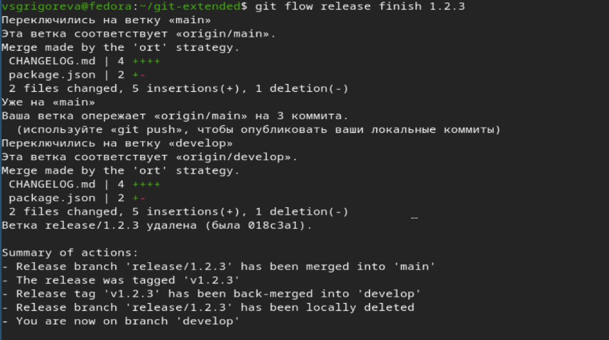
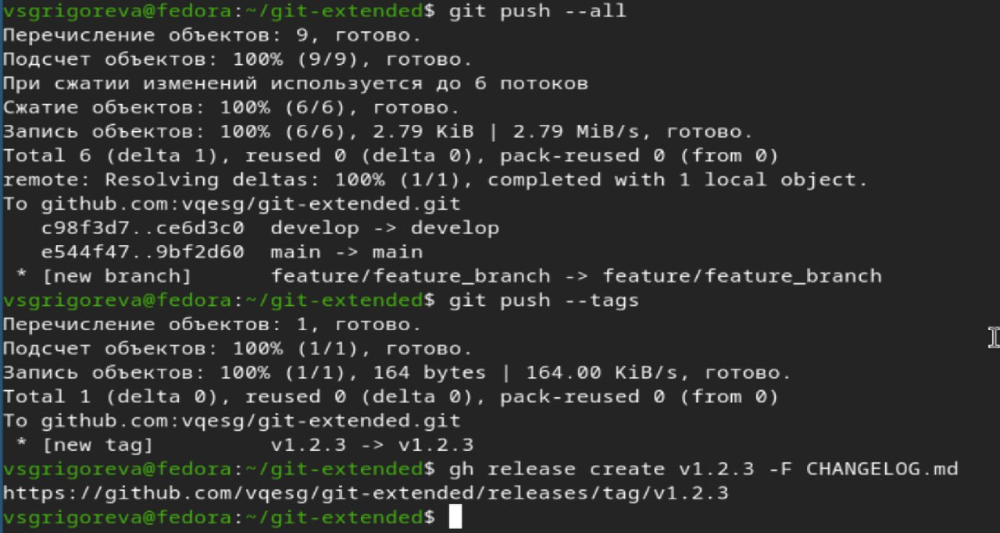

---
## Front matter
lang: ru-RU
title: Лабораторная работа №4
subtitle: Операционные системы
author:
  - Григорьева Валерия Сергеевна
institute:
  - Российский университет дружбы народов, Москва, Россия
date: 05 марта 2026

## i18n babel
babel-lang: russian
babel-otherlangs: english

## Formatting pdf
toc: false
toc-title: Содержание
slide_level: 2
aspectratio: 169
section-titles: true
theme: metropolis
header-includes:
 - \metroset{progressbar=frametitle,sectionpage=progressbar,numbering=fraction}
---

# Информация

## Докладчик

:::::::::::::: {.columns align=center}
::: {.column width="70%"}

  * Григорьева Валерия Сергеевна
  * студентка НКАбд-02-25
  * Российский университет дружбы народов им.П.Лумумбы
  * [1032253494@rudn.ru](mailto:1032253494@rudn.ru)

:::
::: {.column width="30%"}

:::
::::::::::::::

## Цель работы

Целью работы было получить навыки правильной работы с репозиториями git.

## Задание

- Выполнить работу для тестового репозитория.

- Преобразовать рабочий репозиторий в репозиторий с git-flow и conventional commits.

## Теоретическое введение

В процессе разработки программного обеспечения важную роль играет правильная организация работы с системой контроля версий Git. Одной из наиболее распространённых моделей ветвления является Gitflow Workflow, предложенная Винсент Дриссен. Данная модель ориентирована на проекты с регулярными релизами и предполагает строгую структуру веток.

В Gitflow используются две основные постоянные ветки: master и develop. Ветка master содержит стабильные версии продукта и историю релизов, а ветка develop предназначена для интеграции новых функций. Каждый релиз в ветке master обычно помечается номером версии. Для реализации новой функциональности создаются ветки feature, которые формируются от develop. После завершения работы они объединяются обратно с этой веткой. 

# Выполнение лабораторной работы

## Устновка ПО

Для начала работы я установила из коллекции репозиториев Copr, gitflow, Node.js и pnpm.

{#fig-001 width=50%}

## Добавление каталога с исполняемыми файлами

Далее необходимо было для работы с Node.js добавить каталог с исполняемыми файлами, устанавливаемыми yarn, в переменную PATH. Я заупстила pnpm setup.

{#fig-004 width=50%}

## Установка git-cz

Затем ввела команду для программы, которая используется для помощи в форматировании коммитов, и другую программу, которая используется для помощи в создании логов. При этом устанавливается скрипт git-cz, который мы и будем использовать для коммитов.

{#fig-005 width=50%}

## Создание репозитория

Затем создала репозиторий на GitHub с названием git-extended, сделала первый коммит и выложила на github.

{#fig-006 width=50%}

{#fig-007 width=50%}

## Конфигурация для пакетов Node.js
 
{#fig-008 width=50%}

## Форматирование коммитов 

Затем я открыла в nano файл package.json и добавила туда команду для формирования коммитов. Затем пробую выполнить коммит, и все получается. Далее отправляю на github.

{#fig-009 width=50%}

{#fig-010 width=50%}

## Настройка git-flow

Далее я инициализировала git-flow, установив префикс для ярлыков v, проверила, что я на ветке develop. Затем загрузилп весь репозиторий в хранилище и установила внешнюю ветку как вышестоящую для этой ветки.

{#fig-011 width=50%}

## Создание релиза 1.0.0

Затем создадала релиз с версией 1.0.0, создадала журнал изменений и добавила его в индекс. Далее залила релизную ветку в основную ветку.

{#fig-012 width=50%}

{#fig-013 width=50%}

## Отправка данных на github

Следующим шагом отправила данные на github, затем создала там релиз.

{#fig-014 width=50%}

## Создание релизной ветки

Далее создадала ветку для новой функциональности. По окончании разработки новой функциональности следующим шагом нужно было объединить ветку feature_branch c develop. Затем необходимо было создать релиз git-flow с версией 1.2.3, обновить номер версии в файле package.json (1.2.3), создать журнал изменений и добавить туда индекс.

{#fig-016 width=50%}

## Завершение релиза

Далее залила релизную ветку в основную ветку.

{#fig-016 width=50%}

## Отправка данных на github

В конце лабораторной работы отправила данные на github, создадала релиз на github с комментарием из журнала изменений.

{#fig-017 width=50%}

## Выводы

В ходе лабораторной работы я получила навыки работы с git-flow.
