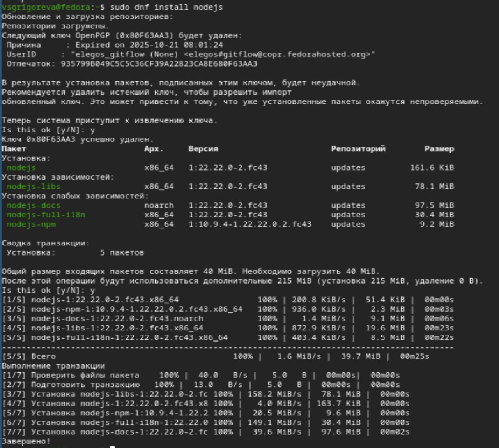
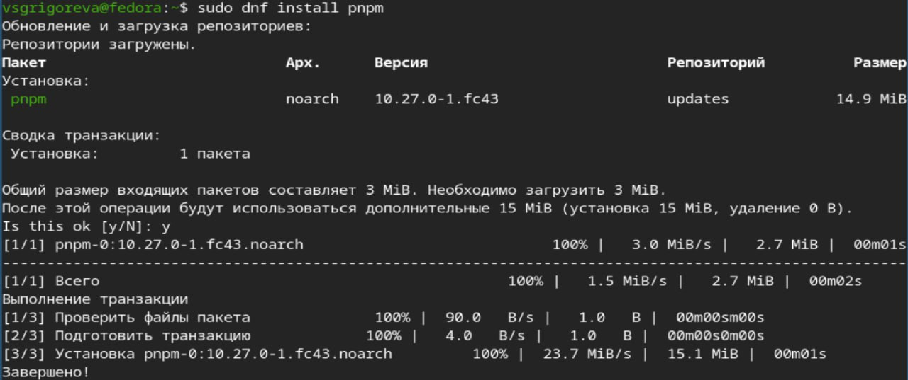
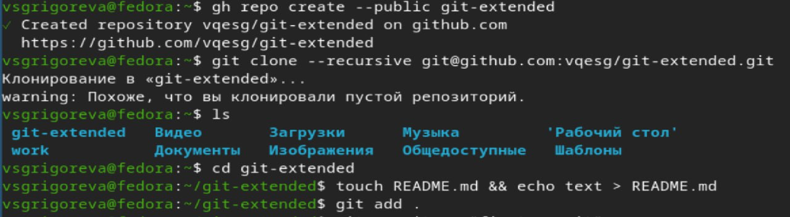
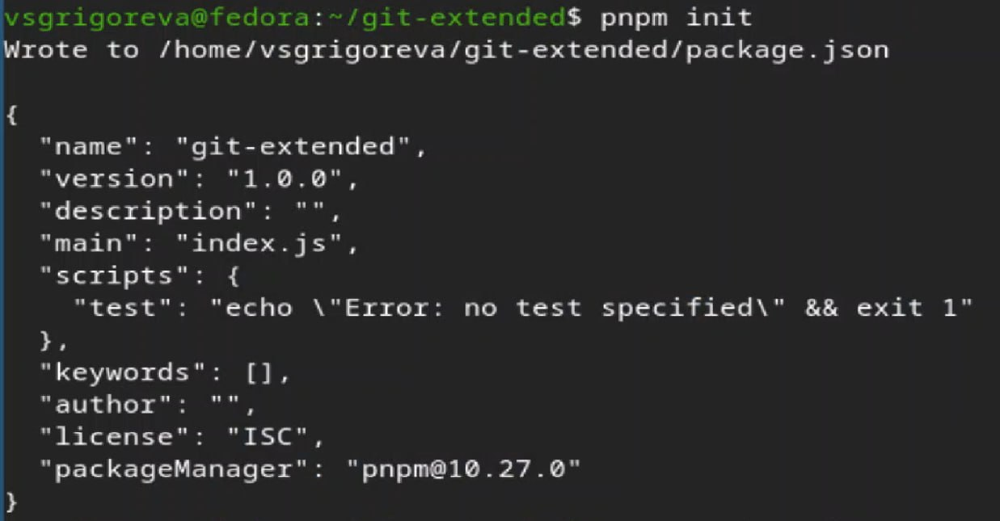
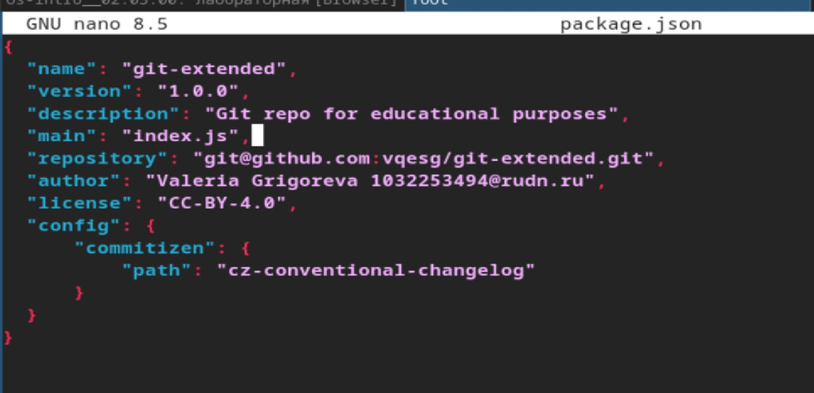
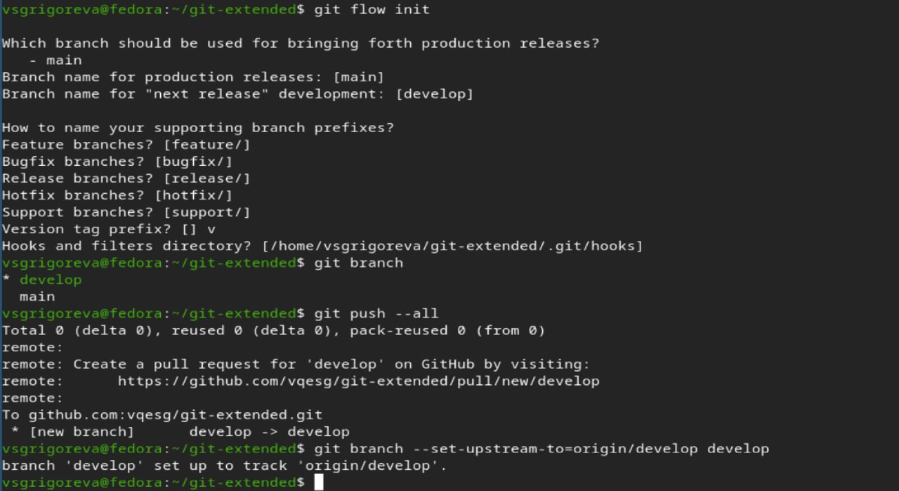
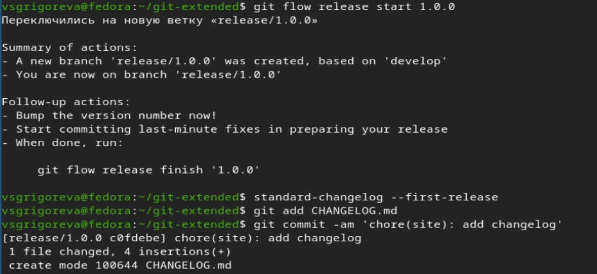
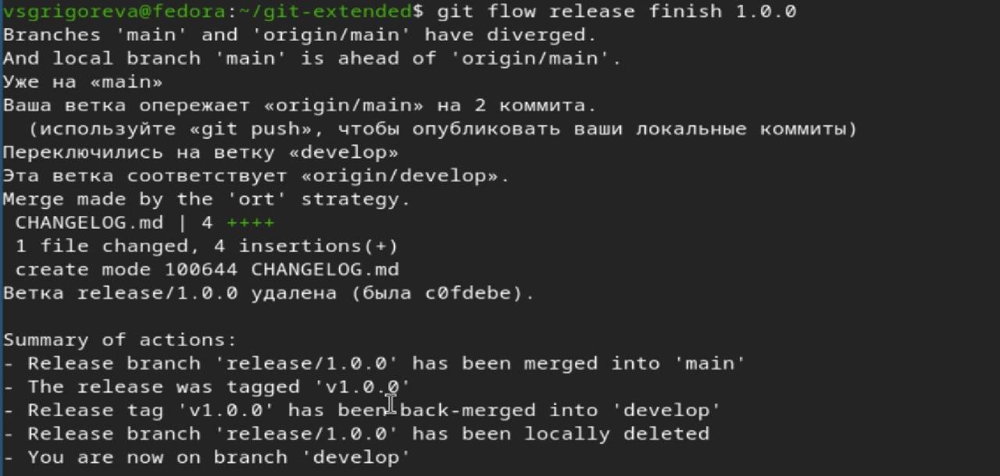
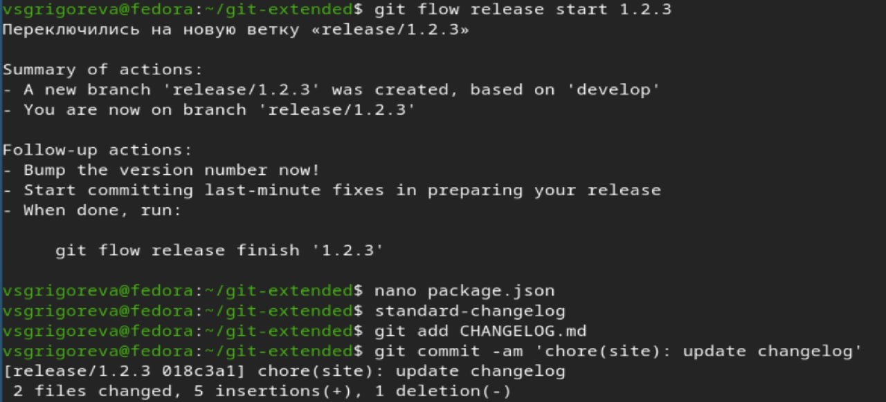

---
## Author
author:
  name: Валерия Сергеевна Григорьева
  degrees: DSc
  orcid: 0000-0002-0877-7063
  email: 1032253494@rudn.ru
  affiliation:
    - name: Российский университет дружбы народов
      country: Российская Федерация
      postal-code: 117198
      city: Москва
      address: ул. Миклухо-Маклая, д. 6

## Title
title: "Лабораторная работа №4"
subtitle: "дисциплина: Архитектура компьютеров"
license: "CC BY"
---

# Цель работы

Целью работы было получить навыки правильной работы с репозиториями git.

# Задание

- Выполнить работу для тестового репозитория.

- Преобразовать рабочий репозиторий в репозиторий с git-flow и conventional commits.

# Теоретическое введение

В процессе разработки программного обеспечения важную роль играет правильная организация работы с системой контроля версий Git. Одной из наиболее распространённых моделей ветвления является Gitflow Workflow, предложенная Винсент Дриссен. Данная модель ориентирована на проекты с регулярными релизами и предполагает строгую структуру веток.

В Gitflow используются две основные постоянные ветки: master и develop. Ветка master содержит стабильные версии продукта и историю релизов, а ветка develop предназначена для интеграции новых функций. Каждый релиз в ветке master обычно помечается номером версии.

Для реализации новой функциональности создаются ветки feature, которые формируются от develop. После завершения работы они объединяются обратно с этой веткой. Когда в develop накапливается достаточное количество изменений, создаётся ветка release для подготовки релиза. В ней выполняется тестирование и исправление ошибок без добавления новых функций. После завершения подготовки ветка release объединяется с master и develop.

В случае обнаружения критической ошибки в опубликованной версии создаётся ветка hotfix непосредственно от master. После исправления она объединяется с master и develop, а версия проекта обновляется.

Таким образом, Gitflow позволяет разделить разработку новых функций, подготовку релизов и срочные исправления, обеспечивая стабильность и управляемость проекта.

Для обозначения версий используется подход SemVer — семантическое версионирование. Версия записывается в формате MAJOR.MINOR.PATCH:

MAJOR увеличивается при несовместимых изменениях API;

MINOR — при добавлении новой функциональности без нарушения совместимости;

PATCH — при исправлении ошибок.

Такой подход делает развитие проекта предсказуемым и понятным для пользователей.

Для стандартизации сообщений коммитов применяется спецификация Conventional Commits, тесно связанная с SemVer. Сообщение имеет структуру:

<type>(<scope>): <subject>

Наиболее распространённые типы:

feat — добавление новой функции;

fix — исправление ошибки;

BREAKING CHANGE — изменение, нарушающее обратную совместимость;

revert — отмена предыдущего коммита.

Расширенный набор типов используется в соглашении Angular (The Angular convention), применяемом в проектах, связанных с Angular.

Совместное использование Gitflow, семантического версионирования и стандартизированных коммитов обеспечивает чёткую организацию разработки, удобное управление версиями и автоматическую генерацию журнала изменений.

# Выполнение лабораторной работы

Для начала работы я установила из коллекции репозиториев Copr и gitflow ([рис. @fig-001]).

{#fig-001 width=70%}

Затем установила Node.js ([рис. @fig-002]).

{#fig-002 width=70%}

и pnpm ([рис. @fig-003]).

{#fig-003 width=70%}

Далее необходимо было для работы с Node.js добавиьб каталог с исполняемыми файлами, устанавливаемыми yarn, в переменную PATH. Я заупстила pnpm setup ([рис. @fig-004]).

{#fig-004 width=70%}

Затем ввела команду для программы, которая используется для помощи в форматировании коммитов, и другую программу, которая используется для помощи в создании логов ([рис. @fig-005]). При этом устанавливается скрипт git-cz, который мы и будем использовать для коммитов.

{#fig-005 width=70%}

Затем создала репозиторий на GitHub с названием git-extended ([рис. @fig-006]).

{#fig-006 width=70%}

Далее сделала первый коммит и выложила на github ([рис. @fig-007]).

{#fig-007 width=70%}

Конфигурация для пакетов Node.js ([рис. @fig-008]).

{#fig-008 width=70%}

Затем я открыла в nano файл package.json и добавила туда команду для формирования коммитов ([рис. @fig-009]).

{#fig-009 width=70%}

Затем пробую выполнить коммит ([рис. @fig-010]), и все получается. Далее отправляю на github.

{#fig-010 width=70%}

Далее я инициализировала git-flow, установив префикс для ярлыков установим в v, проверила, что я на ветке develop. Затем загрузилп весь репозиторий в хранилище и установила внешнюю ветку как вышестоящую для этой ветки ([рис. @fig-011]).

{#fig-011 width=70%}

Затем создадала релиз с версией 1.0.0, создадала журнал изменений и добавила его в индекс ([рис. @fig-012]).

{#fig-012 width=70%}

Далее залила релизную ветку в основную ветку ([рис. @fig-013]).

{#fig-013 width=70%}

Следующим шагом отправила данные на github, затем создала там релиз ([рис. @fig-014]).

{#fig-014 width=70%}

Далее создадала ветку для новой функциональности. По окончании разработки новой функциональности следующим шагом нужно было объединить ветку feature_branch c develop.

Затем необходимо было создать релиз git-flow с версией 1.2.3, обновить номер версии в файле package.json (1.2.3), создать журнал изменений и добавить туда индекс. ([рис. @fig-015]).

{#fig-015 width=70%}

Далее залила релизную ветку в основную ветку ([рис. @fig-016]).

{#fig-016 width=70%}

В конце лабораторной работы отправила данные на github, создадала релиз на github с комментарием из журнала изменений ([рис. @fig-017]).

{#fig-017 width=70%}

# Выводы

В ходе лабораторной работы я получила навыки работы с git-flow.

# Список литературы{.unnumbered}

::: {#refs}
:::
