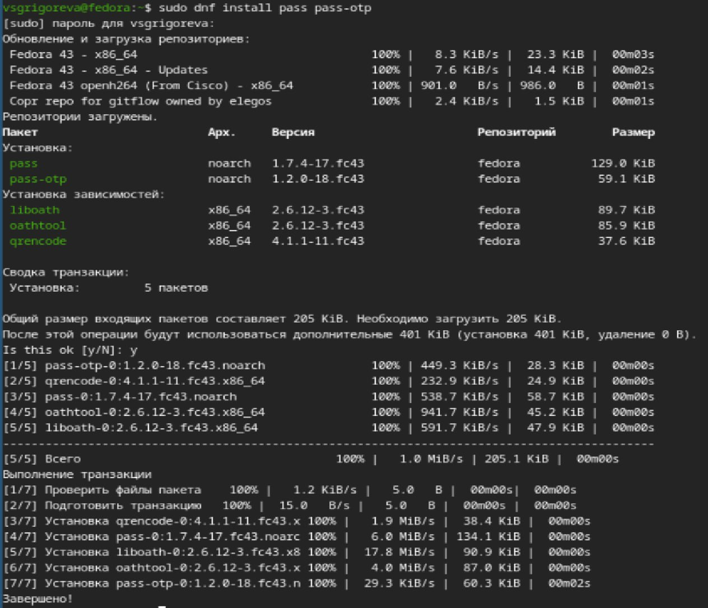
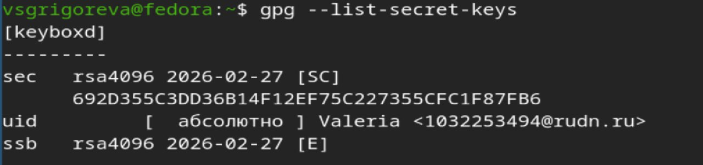
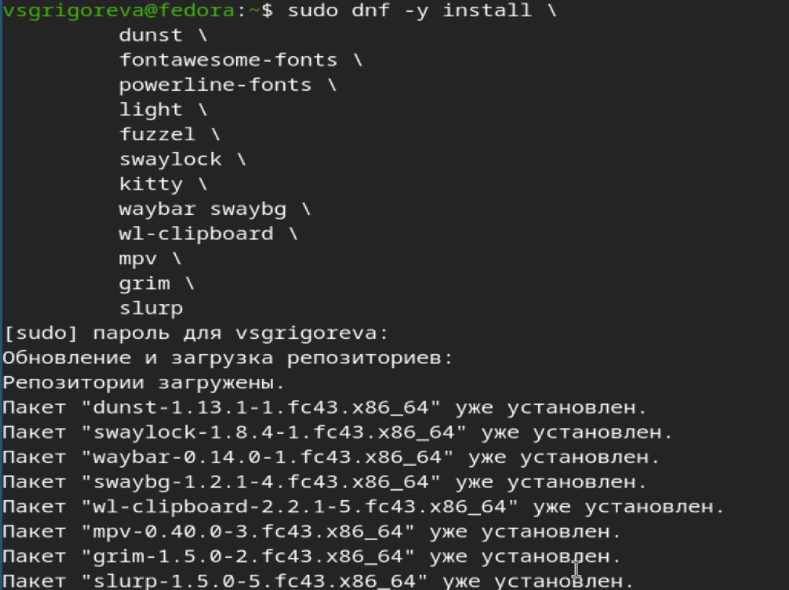
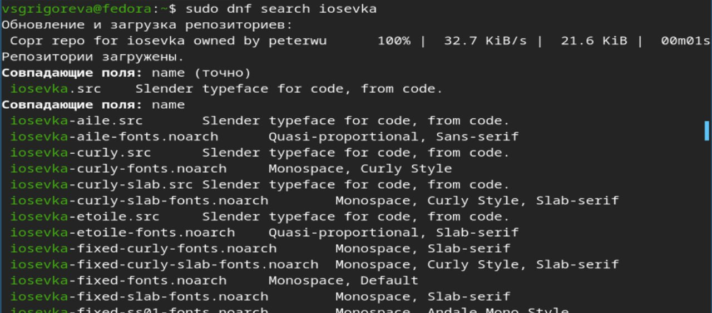
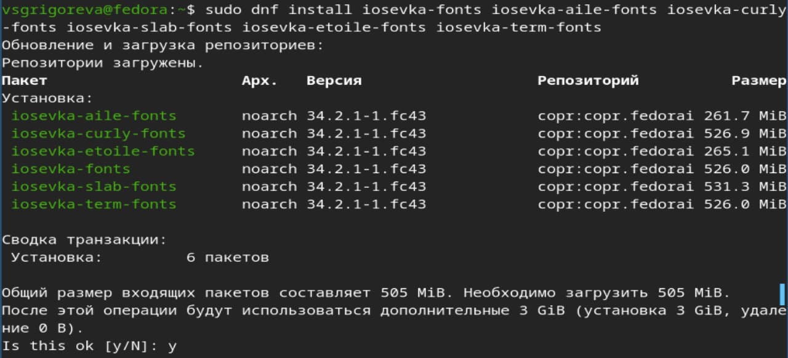
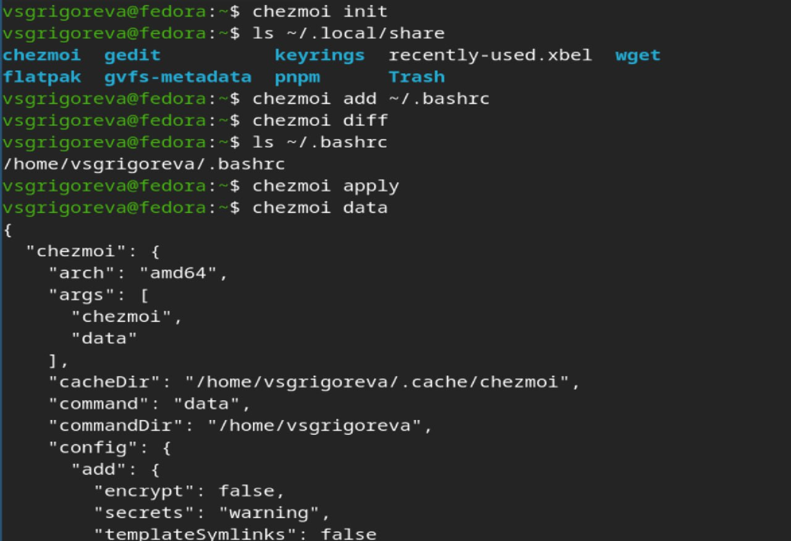

---
## Front matter
lang: ru-RU
title: Лабораторная работа №5
subtitle: Операционные системы
author:
  - Григорьева Валерия Сергеевна
institute:
  - Российский университет дружбы народов, Москва, Россия
date: 12 марта 2026

## i18n babel
babel-lang: russian
babel-otherlangs: english

## Formatting pdf
toc: false
toc-title: Содержание
slide_level: 2
aspectratio: 169
section-titles: true
theme: metropolis
header-includes:
 - \metroset{progressbar=frametitle,sectionpage=progressbar,numbering=fraction}
---

# Информация

## Докладчик

:::::::::::::: {.columns align=center}
::: {.column width="70%"}

  * Григорьева Валерия Сергеевна
  * студентка НКАбд-02-25
  * Российский университет дружбы народов им. П.Лумумбы
  * [1032253494@rudn.ru](mailto:1032253494@rudn.ru)

:::
::: {.column width="30%"}

:::
::::::::::::::

## Цель работы 

Целью работы было настроить рабочу среду.

## Теоретическое введение 

Менеджер паролей pass реализован в духе Unix и является стандартным менеджером паролей для этой системы. Данные хранятся в виде файлов в файловой системе и шифруются с помощью GPG-ключей. Структура базы паролей может быть произвольной, но для удобства и интеграции с дополнительными утилитами её организуют в каталоги, где каждый файл соответствует определённому пользователю, хосту и порту.

Pass имеет несколько реализаций: классическую и расширенную — gopass. 

## Теоретическое введение 

Chezmoi используется для управления файлами конфигурации домашнего каталога пользователя и синхронизации их между машинами через Git. Рабочие файлы хранятся в каталоге ~/.local/share/chezmoi, а локальный конфигурационный файл — в ~/.config/chezmoi/chezmoi.toml. С помощью chezmoi можно добавлять файлы в контроль (add), проверять изменения (diff), применять конфигурации (apply) и создавать шаблоны (.tmpl) для параметризации конфигураций в зависимости от машины или окружения.

Шаблоны в chezmoi используют синтаксис Go и поддерживают логические выражения, переменные и функции для автоматизации настройки системы. Это позволяет управлять конфигурациями на нескольких машинах, тестировать их, изменять и синхронизировать через Git, обеспечивая единообразие рабочего окружения.

# Выполнение лабораторной работы

## Устновка pass

Для начала работы я установила pass.

{#fig-001 width=50%}

## GPG ключи

Далее я посмотрела список gpg ключей.

{#fig-002 width=70%}

## Работа с pass

Затем я инициализировала хранилище с помощью команды pass init, добавила новый пароль, отобразила его, сгенерировала другой пароль.

{#fig-003 width=70%}

## Установка ПО

Затем я установила дополнительное програмное обеспечение.

{#fig-004 width=70%}

## Установка шрифтов

Далее установила шрифты.

{#fig-005 width=40%}

{#fig-006 width=40%}

{#fig-007 width=40%}

## Установка сhezmoi

Затем я скачала chezmoi и проверила, что он установился.

{#fig-008 width=70%}

## Работа с chezmoi

Далее я инициализировала chezmoi, добавила файл .bashrc и применила chezmoi, а затем с помощью команды data проверла chezmoi.

{#fig-009 width=70%}

## Выводы

В ходе лабораторной работы я научилась работать с менеджером паролей pass, установила chezmoi. 
