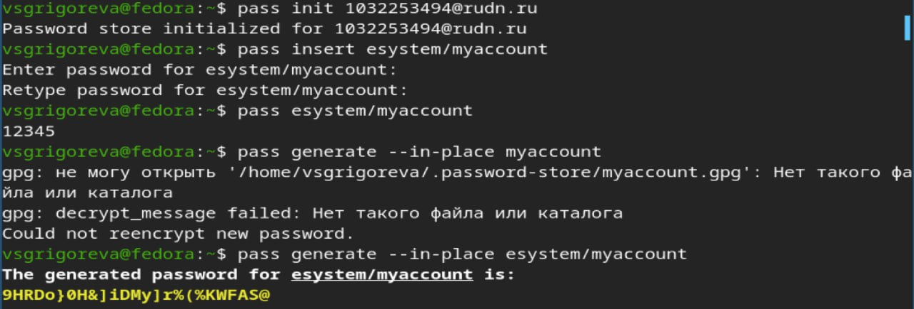
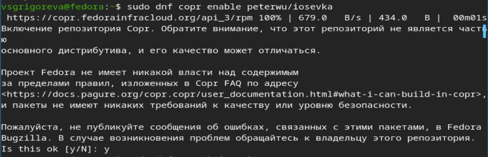
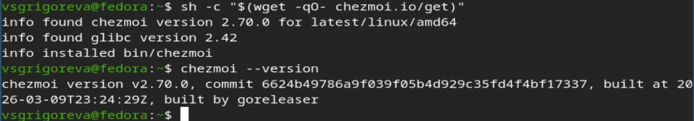

---
## Author
author:
  name: Валерия Сергеевна Григорьева 
  degrees: DSc
  orcid: 0000-0002-0877-7063
  email: 1032253494@rudn.ru
  affiliation:
    - name: Российский университет дружбы народов
      country: Российская Федерация
      postal-code: 117198
      city: Москва
      address: ул. Миклухо-Маклая, д. 6

## Title
title: "Лабораторная работа №5"
subtitle: "дисциплина: Архитектура компьютеров"
license: "CC BY"
---

# Цель работы

Целью работы было настроить рабочу среду.

# Задание

- Установить дополнительное ПО

- Установить и настроить pass

- Настроить интерфейс с браузером

- Сохранения пароля

- Установить и настроить chezmoi

# Теоретическое введение

Менеджер паролей pass реализован в духе Unix и является стандартным менеджером паролей для этой системы. Данные хранятся в виде файлов в файловой системе и шифруются с помощью GPG-ключей. Структура базы паролей может быть произвольной, но для удобства и интеграции с дополнительными утилитами её организуют в каталоги, где каждый файл соответствует определённому пользователю, хосту и порту.

Pass имеет несколько реализаций: классическую и расширенную — gopass. 

Chezmoi используется для управления файлами конфигурации домашнего каталога пользователя и синхронизации их между машинами через Git. Рабочие файлы хранятся в каталоге ~/.local/share/chezmoi, а локальный конфигурационный файл — в ~/.config/chezmoi/chezmoi.toml. С помощью chezmoi можно добавлять файлы в контроль (add), проверять изменения (diff), применять конфигурации (apply) и создавать шаблоны (.tmpl) для параметризации конфигураций в зависимости от машины или окружения.

Шаблоны в chezmoi используют синтаксис Go и поддерживают логические выражения, переменные и функции для автоматизации настройки системы. Это позволяет управлять конфигурациями на нескольких машинах, тестировать их, изменять и синхронизировать через Git, обеспечивая единообразие рабочего окружения.

# Выполнение лабораторной работы

Для начала работы я установила pass ([рис. @fig-001]).

{#fig-001 width=70%}

Далее я посмотрела список gpg ключей ([рис. @fig-002]).

{#fig-002 width=70%}

Затем я инициализировала хранилище с помощью команды pass init, добавила новый пароль, отобразила его, сгенерировала другой пароль ([рис. @fig-003]).

{#fig-003 width=70%}

Затем я установила дополнительное програмное обеспечение ([рис. @fig-004]).

{#fig-004 width=70%}

Далее установила шрифты ([рис. @fig-005]), ([рис. @fig-006]), ([рис. @fig-007]).

{#fig-005 width=70%}

{#fig-006 width=70%}

{#fig-007 width=70%}

Затем я скачала chezmoi и проверила, что он установился ([рис. @fig-008]).

{#fig-008 width=70%}

Далее я инициализировала chezmoi, добавила файл .bashrc и применила chezmoi, а затем с помощью команды data проверла chezmoi ([рис. @fig-009]).

{#fig-009 width=70%}

# Выводы

В ходе лабораторной работы я научилась работать с менеджером паролей pass, установила chezmoi. 

# Список литературы{.unnumbered}

::: {#refs}
:::
