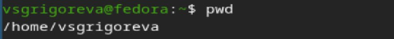
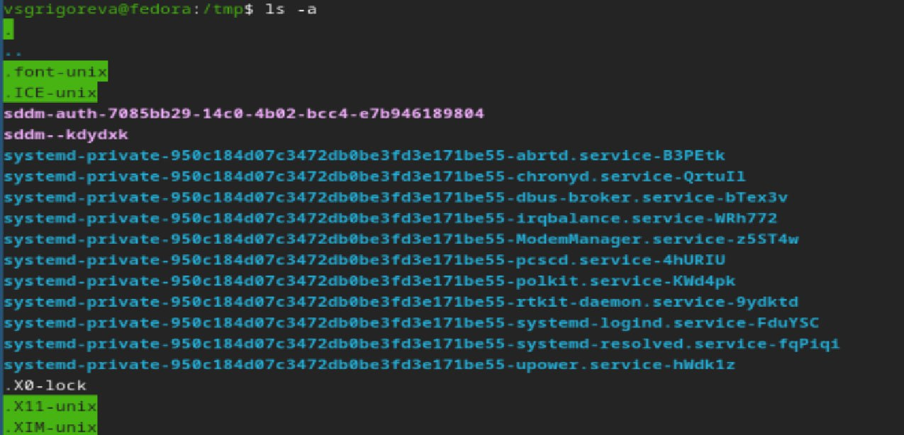
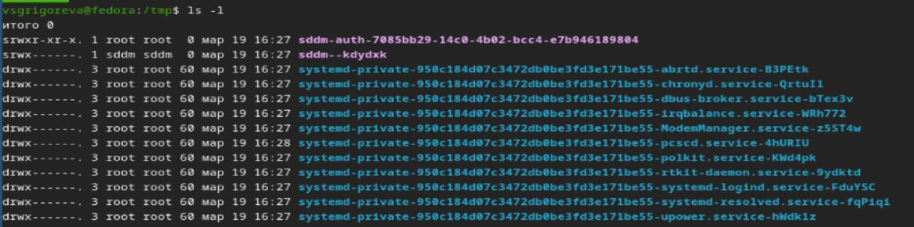
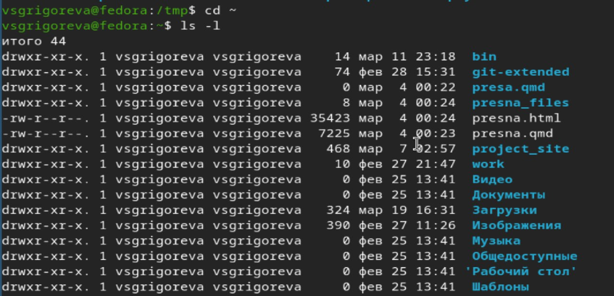
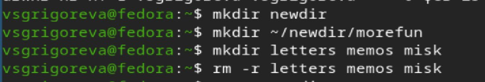
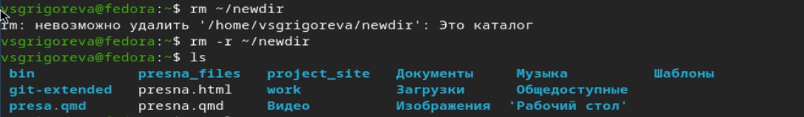
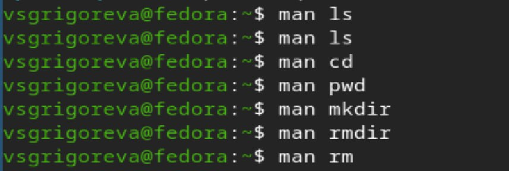

---
## Front matter
lang: ru-RU
title: Лабораторная работа №6
subtitle: Операционные системы
author:
  - Григорьева Валерия Сергеевна
institute:
  - Российский университет дружбы народов, Москва, Россия
date: 20 марта 2026

## i18n babel
babel-lang: russian
babel-otherlangs: english

## Formatting pdf
toc: false
toc-title: Содержание
slide_level: 2
aspectratio: 169
section-titles: true
theme: metropolis
header-includes:
 - \metroset{progressbar=frametitle,sectionpage=progressbar,numbering=fraction}
---

# Информация

## Докладчик

:::::::::::::: {.columns align=center}
::: {.column width="70%"}

  * Григорьева Валерия Сергеевна
  * студентка НКАбд-02-25
  * Российский университет дружбы народов им. П.Лумумбы
  * [1032253494@rudn.ru](mailto:1032253494@rudn.ru)

:::
::: {.column width="30%"}

:::
::::::::::::::

## Цель работы 

Приобретение практических навыков взаимодействия пользователя с системой посредством командной строки.

## Теоретическое введение

В операционной системе типа Linux взаимодействие пользователя с системой обычно осуществляется с помощью командной строки посредством построчного ввода команд. При этом обычно используется командные интерпретаторы языка shell: /bin/sh; /bin/csh; /bin/ksh. Формат команды. Командой в операционной системе называется записанный по специальным правилам текст (возможно с аргументами), представляющий собой указание на выполнение какой-либо функций (или действий) в операционной системе.Обычно первым словом идёт имя команды, остальной текст — аргументы или опции, конкретизирующие действие. Общий формат команд можно представить следующим образом: <имя_команды><разделитель><аргументы>. 

# Выполнение лабораторной работы

## Определение имени домашнего каталога

Для начала работы я определила полное имя своего домашнего каталога.

{#fig-001 width=70%}

## Опции команды ls 

Далее я перешла в каталог /tmp и далее с помощью команды ls с различными опциями. Команда ls просто выводит список всех файлов. Команда ls -a показывает еще и скрытые файлы. Команда ls -l показывает подробную информацию о файлах.

{#fig-002 width=50%}

{#fig-003 width=50%}

{#fig-004 width=50%}

## Поиск подкаталога 

Затем я нашла в каталоге /var/spool подкаталог с именем cron.

{#fig-006 width=70%}

## Содержимое домашнего каталога

Затем я перешла в домашний каталог и вывела на экран его содержимое с помощью комнады ls -l. Владельцем всех файлов и подкаталогов являюсь я (пользовтаель vsgrigoreva).

{#fig-007 width=70%}

## Создание и удаления каталогов

Далее в домашнем каталоге создала новый каталог с именем newdir. В нем создала новый каталог с именем morefun. Следующей командой в домашнем каталоге создала три новых каталога с именами letters, memos, misk. Затем удалила эти каталоги одной командой.

{#fig-008 width=50%}

Далее я попробовала удалить ранее созданный каталог ~/newdir командой rm. Это сделать не получилось. Я удалила каталог ~/newdir командой rm -r, а затем проверила, что он удалился.

{#fig-009 width=50%}

## Команда man

Затем с помощью команды man определила, какую опцию команды ls нужно использовать для просмотра содержимое не только указанного каталога, но и подкаталогов, входящих в него (ls -R). Далее с помощью команды man определила набор опций команды ls, позволяющий отсортировать по времени последнего изменения выводимый список содержимого каталога с развёрнутым описанием файлов (ls -lt). Затем я использовала команду man для просмотра описания следующих команд: cd (переходит между папками), pwd (выводит путь до текущего каталога), mkdir (создает папки), rmdir (удаляет пустые папки), rm (удаляет фалы и папки).

{#fig-010 width=50%}

{#fig-011 width=50%}

## Команда history

Затем я ввела комманду history.

{#fig-012 width=50%}

Используя информацию, полученную при помощи команды history, выполнила модификацию и исполнение команды ls -l.

{#fig-013 width=50%}

## Выводы

В результате выполнения лабораторной работы я приобрела навыки взаимодействия пользовтеля с системой при помощи командной строки.
