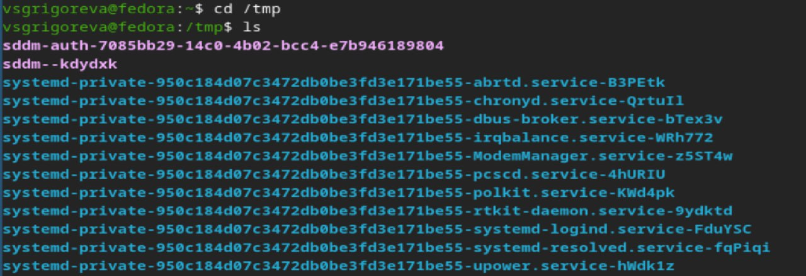
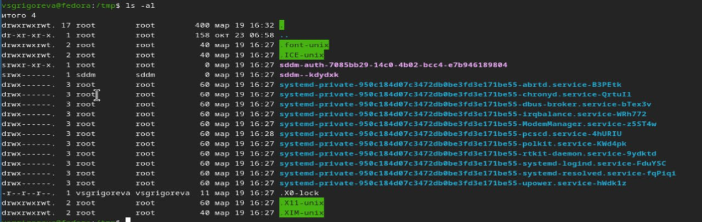
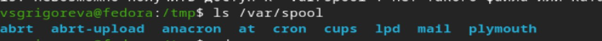
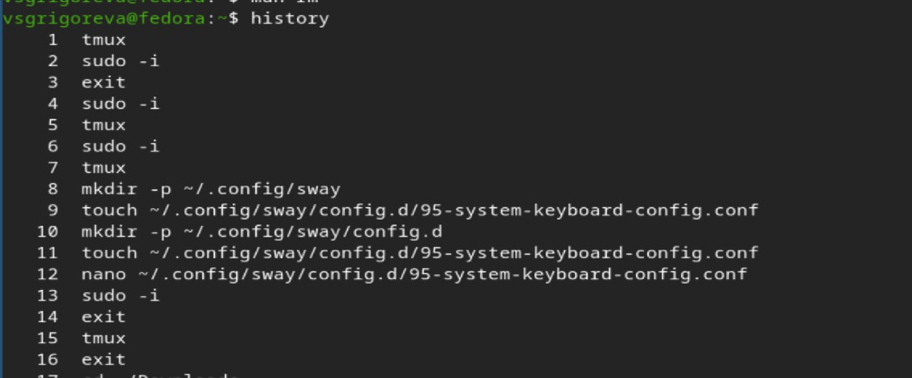
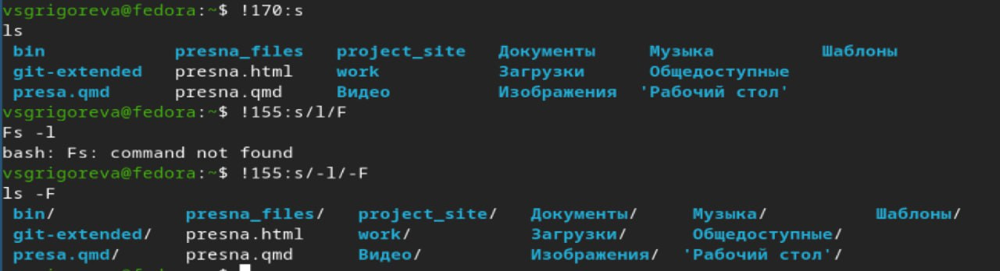

---
## Author
author:
  name: Валерия Сергеевна Григорьева 
  degrees: DSc
  orcid: 0000-0002-0877-7063
  email: 1032253494@rudn.ru
  affiliation:
    - name: Российский университет дружбы народов
      country: Российская Федерация
      postal-code: 117198
      city: Москва
      address: ул. Миклухо-Маклая, д. 6

## Title
title: "Лабораторная работа №6"
subtitle: "дисциплина: Архитектура компьютеров"
license: "CC BY"
---

# Цель работы

Приобретение практических навыков взаимодействия пользователя с системой посредством командной строки.

# Задание

1. Определите полное имя вашего домашнего каталога. Далее относительно этого каталога будут выполняться последующие упражнения.

2. Выполните следующие действия:

2.1. Перейдите в каталог /tmp.

2.2. Выведите на экран содержимое каталога /tmp. Для этого используйте команду ls с различными опциями. Поясните разницу в выводимой на экран информации.

2.3. Определите, есть ли в каталоге /var/spool подкаталог с именем cron?

2.4. Перейдите в Ваш домашний каталог и выведите на экран его содержимое. Определите, кто является владельцем файлов и подкаталогов?

3. Выполните следующие действия:

3.1. В домашнем каталоге создайте новый каталог с именем newdir.

3.2. В каталоге ~/newdir создайте новый каталог с именем morefun.

3.3. В домашнем каталоге создайте одной командой три новых каталога с именами letters, memos, misk. Затем удалите эти каталоги одной командой.

3.4. Попробуйте удалить ранее созданный каталог ~/newdir командой rm. Проверьте, был ли каталог удалён.

3.5. Удалите каталог ~/newdir/morefun из домашнего каталога. Проверьте, был ли каталог удалён.

4. С помощью команды man определите, какую опцию команды ls нужно использовать для просмотра содержимое не только указанного каталога, но и подкаталогов, входящих в него.

5. С помощью команды man определите набор опций команды ls, позволяющий отсортировать по времени последнего изменения выводимый список содержимого каталога с развёрнутым описанием файлов.

6. Используйте команду man для просмотра описания следующих команд: cd, pwd, mkdir, rmdir, rm. Поясните основные опции этих команд.

7. Используя информацию, полученную при помощи команды history, выполните модификацию и исполнение нескольких команд из буфера команд.

# Теоретическое введение

В операционной системе типа Linux взаимодействие пользователя с системой обычно осуществляется с помощью командной строки посредством построчного ввода команд. При этом обычно используется командные интерпретаторы языка shell: /bin/sh; /bin/csh; /bin/ksh. Формат команды. Командой в операционной системе называется записанный по специальным правилам текст (возможно с аргументами), представляющий собой указание на выполнение какой-либо функций (или действий) в операционной системе.Обычно первым словом идёт имя команды, остальной текст — аргументы или опции, конкретизирующие действие. Общий формат команд можно представить следующим образом: <имя_команды><разделитель><аргументы>.

# Выполнение лабораторной работы

Для начала работы я определила полное имя своего домашнего каталога ([рис. @fig-001]).

{#fig-001 width=70%}

Далее я перешла в каталог /tmp и далее с помощью команды ls с различными опциями. Команда ls просто выводит список всех файлов ([рис. @fig-002]).

{#fig-002 width=70%}

Команда ls -a показывает еще и скрытые файлы ([рис. @fig-003]).

{#fig-003 width=70%}

Команда ls -l показывает подробную информацию о файлах ([рис. @fig-004]).

{#fig-004 width=70%}

Команда ls -al показывает все вместе ([рис. @fig-005]).

{#fig-005 width=70%}

Затем я нашла в каталоге /var/spool подкаталог с именем cron ([рис. @fig-006]).

{#fig-006 width=70%}

Затем я перешла в домашний каталог и вывела на экран его содержимое с помощью комнады ls -l. Владельцем всех файлов и подкаталогов являюсь я (пользовтаель vsgrigoreva) ([рис. @fig-007]).

{#fig-007 width=70%}

Далее в домашнем каталоге создала новый каталог с именем newdir. В нем создала новый каталог с именем morefun. Следующей командой в домашнем каталоге создала три новых каталога с именами letters, memos, misk. Затем удалила эти каталоги одной командой ([рис. @fig-008]).

{#fig-008 width=70%}

Далее я попробовала удалить ранее созданный каталог ~/newdir командой rm. Это сделать не получилось. Я удалила каталог ~/newdir командой rm -r, а затем проверила, что он удалился ([рис. @fig-009]).

{#fig-009 width=70%}

Затем с помощью команды man определила, какую опцию команды ls нужно использовать для просмотра содержимое не только указанного каталога, но и подкаталогов, входящих в него (ls -R) ([рис. @fig-010]).

{#fig-010 width=70%}

Далее с помощью команды man определила набор опций команды ls, позволяющий отсортировать по времени последнего изменения выводимый список содержимого каталога с развёрнутым описанием файлов (ls -lt). Затем я использовала команду man для просмотра описания следующих команд: cd (переходит между папками), pwd (выводит путь до текущего каталога), mkdir (создает папки), rmdir (удаляет пустые папки), rm (удаляет фалы и папки) ([рис. @fig-011]).

{#fig-011 width=70%}

Затем я ввела комманду history ([рис. @fig-012]).

{#fig-012 width=70%}

Используя информацию, полученную при помощи команды history, выполнила модификацию и исполнение команды ls -l ([рис. @fig-013]).

{#fig-013 width=70%}

## Контрольные вопросы 

1. Что такое командная строка?

Командная строка — это способ взаимодействия пользователя с операционной системой путём построчного ввода команд через командный интерпретатор (shell).

2. При помощи какой команды можно определить абсолютный путь текущего каталога?

С помощью команды pwd. Пример: pwd. Результат: /home/vsgrigoreva.

3. При помощи какой команды и каких опций можно определить только тип файлов и их имена в текущем каталоге? Приведите примеры.

С помощью команды ls -F. Символы: / — каталог, * — исполняемый файл, @ — ссылка.

4. Каким образом отобразить информацию о скрытых файлах? Приведите примеры.

С помощью опции -a команды ls.

5. При помощи каких команд можно удалить файл и каталог? Можно ли это сделать одной и той же командой? Приведите примеры.

Да, можно одной командой rm или rmdir.

6. Каким образом можно вывести информацию о последних выполненных пользователем командах? работы?

С помощью команды history.

7. Как воспользоваться историей команд для их модифицированного выполнения?

С помощью конструкции !<номер_команды>:s/<что_меняем>/<на_что_меняем>.

8. Приведите примеры запуска нескольких команд в одной строке.

С помощью символа ;. Пример: cd ~/work; ls

9. Дайте определение и приведите примера символов экранирования.

Символ экранирования \ используется для обработки специальных символов.

10. Охарактеризуйте вывод информации на экран после выполнения команды ls с опцией l.

Выводит подробную информацию: тип файла, права доступа, число ссылок, владелец, размер, дата изменения, имя файла.

11. Что такое относительный путь к файлу? Приведите примеры использования относи-
тельного и абсолютного пути при выполнении какой-либо команды.

Относительный путь — путь относительно текущего каталога. Примеры: сd .. cd ./dir

Абсолютный путь: cd /home/user/dir

12. Как получить информацию об интересующей вас команде?

С помощью команды man.

13. Какая клавиша или комбинация клавиш служит для автоматического дополнения вводимых команд?

С помощью клавиши Tab.

# Выводы

В результате выполнения лабораторной работы я приобрела навыки взаимодействия пользовтеля с системой при помощи командной строки.

# Список литературы{.unnumbered}

::: {#refs}
:::
