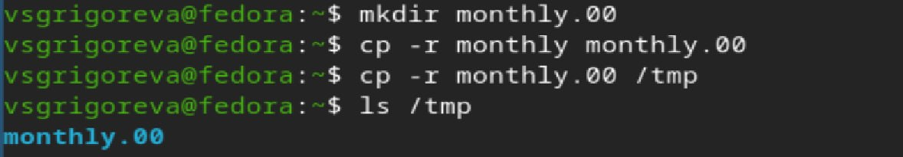
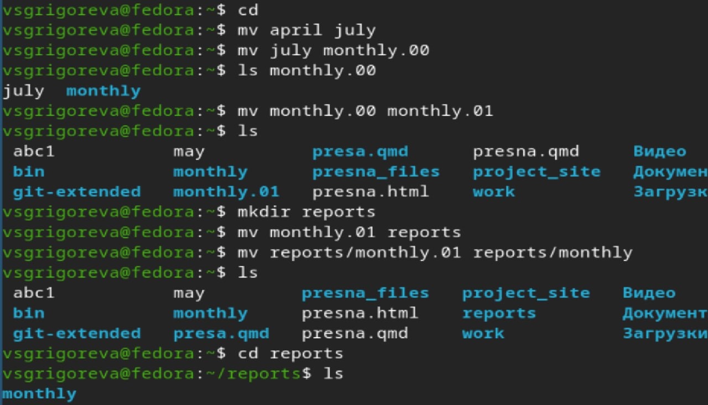
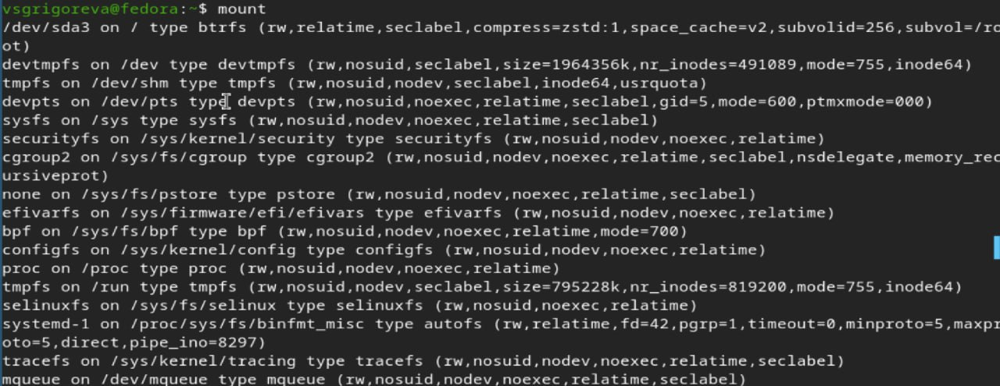
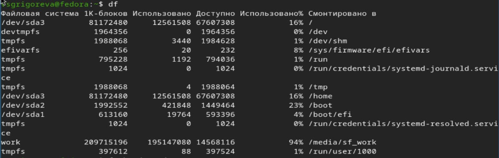
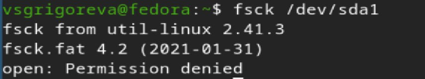
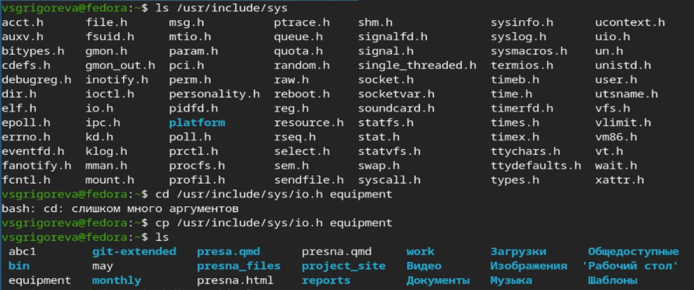
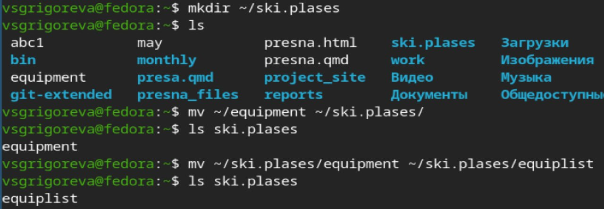
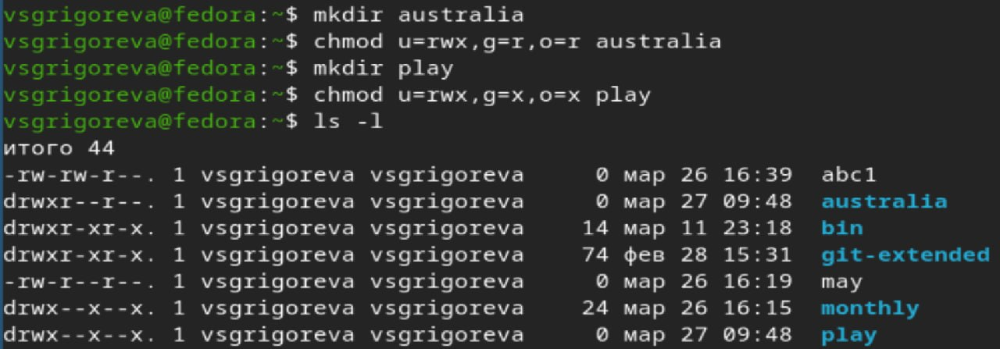
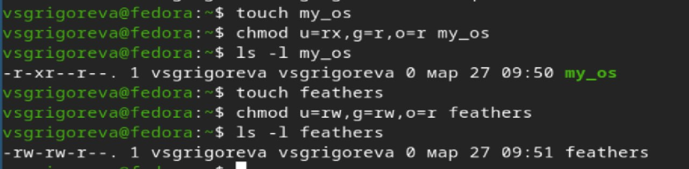
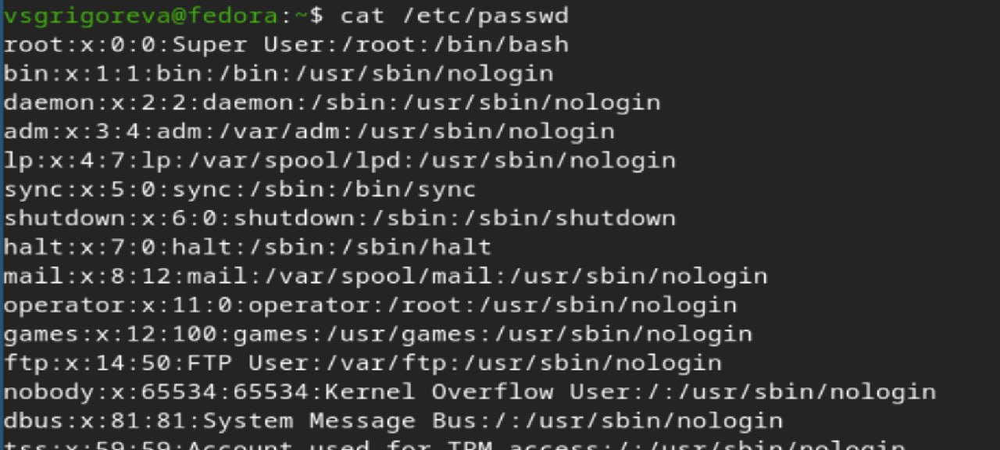

---
## Front matter
lang: ru-RU
title: Лабораторная работа №7
subtitle: Операционные системы
author:
  - Григорьева Валерия Сергеевна
institute:
  - Российский университет дружбы народов, Москва, Россия
date: 27 марта 2026

## i18n babel
babel-lang: russian
babel-otherlangs: english

## Formatting pdf
toc: false
toc-title: Содержание
slide_level: 2
aspectratio: 169
section-titles: true
theme: metropolis
header-includes:
 - \metroset{progressbar=frametitle,sectionpage=progressbar,numbering=fraction}
---

# Информация

## Докладчик

:::::::::::::: {.columns align=center}
::: {.column width="70%"}

  * Григорьева Валерия Сергеевна
  * студентка НКАбд-02-25
  * Российский университет дружбы народов им. П.Лумумбы
  * [1032253494@rudn.ru](mailto:1032253494@rudn.ru)

:::
::: {.column width="30%"}

:::
::::::::::::::

## Цель работы 

Ознакомление с файловой системой Linux, её структурой, именами и содержанием каталогов. Приобретение практических навыков по применению команд для работы с файлами и каталогами, по управлению процессами (и работами), по проверке использования диска и обслуживанию файловой системы.

## Теоретическое введение

Файловая система в Linux состоит из фалов и каталогов. Каждому физическому носителю соответствует своя файловая система. Существует несколько типов файловых систем. Перечислим наиболее часто встречающиеся типы: – ext2fs (second extended filesystem); – ext2fs (third extended file system); – ext4 (fourth extended file system); – ReiserFS; – xfs; – fat (file allocation table); – ntfs (new technology file system). Для просмотра используемых в операционной системе файловых систем можно воспользоваться командой mount без параметров.

# Выполнение лабораторной работы

## Задания из лабораторной работы

Сначала я выполняю примеры из лабораторной работы. Копирование файлов и каталогов.

## Копирование каталогов 

Далее копирую каталоги в текущем и произвольном каталогах.

## Переименование файлов

Затем я переименовываю файлы и перемещаю их.

## Изменение прав доступа

Затем изменяю права доступа.

## Выполнение команды mount

Затем выполняю команду mount.

## Выполнение команды df

Команду df.

## Выполнение команды fsck

И команду fsck /dev/sda1.

## Копирование файла

Затем я копирую файл /usr/include/sys/io.h в домашний каталог.

## Директория ski.plases

Далее создаю директорию ~/ski.plases, перемещаю файл equipment в каталог ~/ski.plases и переименовываю файл ~/ski.plases/equipment в ~/ski.plases/equiplist.

## Копирование, перемещение файлов и каталогов

Затем создаю в домашнем каталоге файл abc1 и копирую его в каталог ~/ski.plases, назвав его equiplist2, создаю каталог с именем equipment в каталоге ~/ski.plases, перемещаю файлы ~/ski.plases/equiplist и equiplist2 в каталог ~/ski.plases/equipment и создаю и перемещаю каталог ~/newdir в каталог ~/ski.plases.

## Изменение прав доступа для каталогов и файлов

Затем изменяю права доступа для каталогов australia и play.

{#fig-012 width=50%}

и для файлов my_os, feathers.

{#fig-012 width=50%}

## Содержимое файла /etc/password

Далее я просматриваю содержимое файла /etc/password.

## Изменения прав доступа файлов

Затем копирую файл ~/feathers в файл ~/file.old, перемещаю его в каталог ~/play, копирую каталог ~/play в каталог ~/fun, перемещаю каталог ~/fun в каталог ~/play и называю его games, лишаю владельца файла ~/feathers права на чтение (если попытаться посмотреть файл ~/feathers командой cat или скопировать его, будет отказано в доступе), даю владельцу файла ~/feathers право на чтение, лишаю , а затем даю владельца каталога ~/play права на выполнение.

{#fig-014 width=50%}

## Чтение man

Затем читаю man по командам: mount (монтирование файловых систем, пример: mount /dev/sda1 /mnt), fsck (проверка и исправление файловой системы, fsck /dev/sda1), mkfs (создание файловой системы, mkfs.ext4 /dev/sda1), kill (завершение процессов, kill 1234).

## Выводы

В результате выполнения лабораторной работы я ознакомилась с файловой системой Linux, её структурой, именами и содержанием каталогов, приобрела навыки по применению команд для работы с файлами и каталогами, по управлению процессами (и работами), по проверке использования диска и обслуживанию файловой системы.
