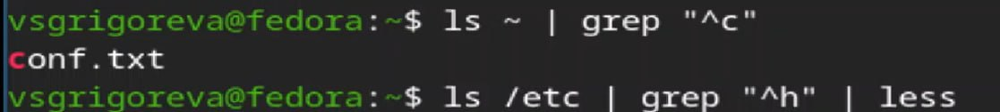
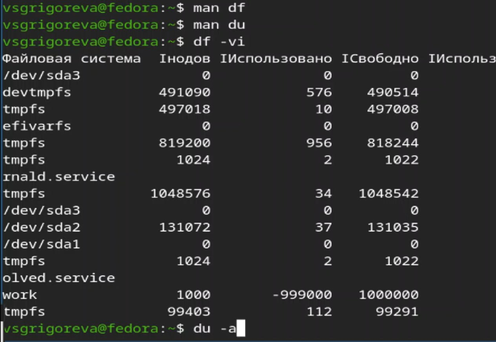

---
## Front matter
lang: ru-RU
title: Лабораторная работа №8
subtitle: Операционные системы
author:
  - Григорьева Валерия Сергеевна
institute:
  - Российский университет дружбы народов, Москва, Россия
date: 3 апреля 2026

## i18n babel
babel-lang: russian
babel-otherlangs: english

## Formatting pdf
toc: false
toc-title: Содержание
slide_level: 2
aspectratio: 169
section-titles: true
theme: metropolis
header-includes:
 - \metroset{progressbar=frametitle,sectionpage=progressbar,numbering=fraction}
---

# Информация

## Докладчик

:::::::::::::: {.columns align=center}
::: {.column width="70%"}

  * Григорьева Валерия Сергеевна
  * студентка НКАбд-02-25
  * Российский университет дружбы народов им. П.Лумумбы
  * [1032253494@rudn.ru](mailto:1032253494@rudn.ru)

:::
::: {.column width="30%"}

:::
::::::::::::::

## Цель работы 

Ознакомление с инструментами поиска файлов и фильтрации текстовых данных. Приобретение практических навыков: по управлению процессами (и заданиями), по проверке использования диска и обслуживанию файловых систем.

## Теоретическое введение

В системе по умолчанию открыто три специальных потока: – stdin — стандартный поток ввода (по умолчанию: клавиатура), файловый дескриптор 0; – stdout — стандартный поток вывода (по умолчанию: консоль), файловый дескриптор 1; – stderr — стандартный поток вывод сообщений об ошибках (по умолчанию: консоль), файловый дескриптор 2. Большинство используемых в консоли команд и программ записывают результаты своей работы в стандартный поток вывода stdout. Например, команда ls выводит в стандартный поток вывода (консоль) список файлов в текущей директории. Потоки вывода и ввода можно перенаправлять на другие файлы или устройства. Проще всего это делается с помощью символов >, >>, <, <<. Конвейер (pipe) служит для объединения простых команд или утилит в цепочки, в ко- торых результат работы предыдущей команды передаётся последующей. Команда find используется для поиска и отображения на экран имён файлов, соответствующих заданной строке символов.

# Выполнение лабораторной работы

## Запись в файл file.txt

В начале я записала в файл file.txt названия файлов, содержащихся в домашнем каталоге и каталоге /etc, и проверила выполнение.

## Запись в файл conf.txt

Затем записала имена всех файлов из file.txt, имеющих расширение .conf в новый текстовой файл conf.txt.

## Вывод файлов, название которых начинается на с

Далее вывела имена файлов, которые имеют имена, начинавшиеся с символа c. Это можно сделать несколькими колмандами: ls ~ | grep "^c" и find ~ -name "c*", а затем имена файлов из каталога /etc, начинающиеся с символа h (по странично).

## Запись в файл ~/logfile

Далее запустила в фоновом режиме процесс, который будет записывать в файл ~/logfile файлы, имена которых начинаются с log, а затем удалила файл ~/logfile.

## Запуск в фоновом режиме редактора gedit

Далее запустила в фоновом режиме редактор gedit, определила идентификатор процесса gedit, используя команду ps, конвейер и фильтр grep, прочтитала справку команды kill, после чего использовала её для завершения процесса gedit.

## Выполнение команд df и du
Затем выполнила команды df и du, предварительно получив более подробную информацию об этих командах, с помощью команды man.

## Имена всех директорий

Далее вывела имена всех директорий, имеющихся в вашем домашнем каталоге.

## Выводы

В процессе выполнения лабораторной работы я ознакомилась с инструментами поиска файлов и фильтрации текстовых данных, приобрела практические навыки: по управлению процессами (и заданиями), по проверке использования диска и обслуживанию файловых систем.
