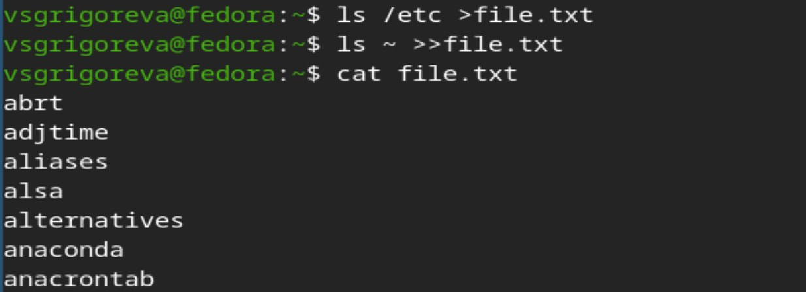
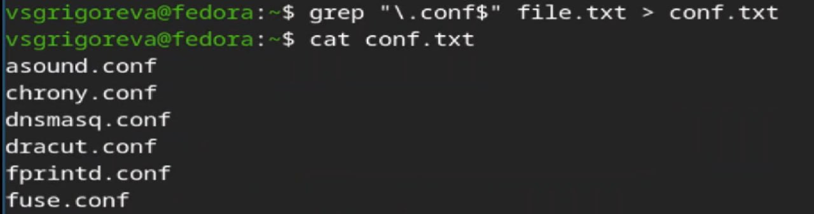
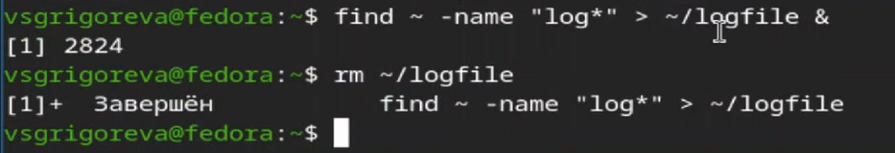
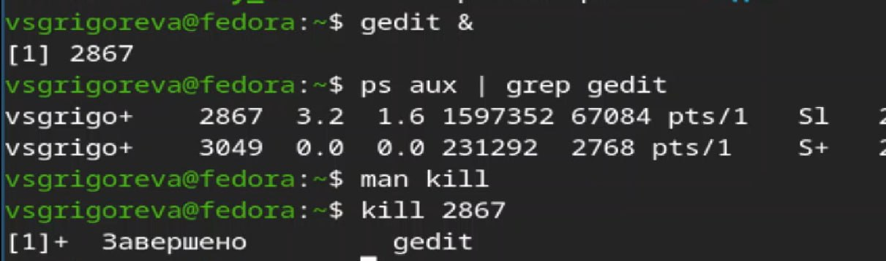
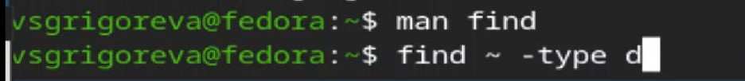

---
## Author
author:
  name: Валерия Сергеевна Григорьева 
  degrees: DSc
  orcid: 0000-0002-0877-7063
  email: 1032253494@rudn.ru
  affiliation:
    - name: Российский университет дружбы народов
      country: Российская Федерация
      postal-code: 117198
      city: Москва
      address: ул. Миклухо-Маклая, д. 6

## Title
title: "Лабораторная работа №8"
subtitle: "дисциплина: Архитектура компьютеров"
license: "CC BY"
---

# Цель работы

Ознакомление с инструментами поиска файлов и фильтрации текстовых данных. Приобретение практических навыков: по управлению процессами (и заданиями), по проверке использования диска и обслуживанию файловых систем.

# Задание

1. Осуществите вход в систему, используя соответствующее имя пользователя.

2. Запишите в файл file.txt названия файлов, содержащихся в каталоге /etc. Допишите в этот же файл названия файлов, содержащихся в вашем домашнем каталоге.

3. Выведите имена всех файлов из file.txt, имеющих расширение .conf, после чего запишите их в новый текстовой файл conf.txt.

4. Определите, какие файлы в вашем домашнем каталоге имеют имена, начинавшиеся с символа c? Предложите несколько вариантов, как это сделать.

5. Выведите на экран (по странично) имена файлов из каталога /etc, начинающиеся с символа h.

6. Запустите в фоновом режиме процесс, который будет записывать в файл ~/logfile файлы, имена которых начинаются с log.

7. Удалите файл ~/logfile.

8. Запустите из консоли в фоновом режиме редактор gedit. 

9. Определите идентификатор процесса gedit, используя команду ps, конвейер и фильтр grep. Как ещё можно определить идентификатор процесса?

10. Прочтите справку (man) команды kill, после чего используйте её для завершения процесса gedit.

11. Выполните команды df и du, предварительно получив более подробную информацию об этих командах, с помощью команды man.

12. Воспользовавшись справкой команды find, выведите имена всех директорий, имеющихся в вашем домашнем каталоге.

# Теоретическое введение

В системе по умолчанию открыто три специальных потока: – stdin — стандартный поток ввода (по умолчанию: клавиатура), файловый дескриптор 0; – stdout — стандартный поток вывода (по умолчанию: консоль), файловый дескриптор 1; – stderr — стандартный поток вывод сообщений об ошибках (по умолчанию: консоль), файловый дескриптор 2. Большинство используемых в консоли команд и программ записывают результаты своей работы в стандартный поток вывода stdout. Например, команда ls выводит в стандартный поток вывода (консоль) список файлов в текущей директории. Потоки вывода и ввода можно перенаправлять на другие файлы или устройства. Проще всего это делается с помощью символов >, >>, <, <<. Конвейер (pipe) служит для объединения простых команд или утилит в цепочки, в ко- торых результат работы предыдущей команды передаётся последующей. Команда find используется для поиска и отображения на экран имён файлов, соответствующих заданной строке символов.

# Выполнение лабораторной работы

В начале я записала в файл file.txt названия файлов, содержащихся в домашнем каталоге и каталоге /etc, и проверила выполнение ([рис. @fig-001]).

{#fig-001 width=70%}

Затем записала имена всех файлов из file.txt, имеющих расширение .conf в новый текстовой файл conf.txt ([рис. @fig-002]).

{#fig-002 width=70%}

Далее вывела имена файлов, которые имеют имена, начинавшиеся с символа c. Это можно сделать несколькими колмандами: ls ~ | grep "^c" и find ~ -name "c*", а затем имена файлов из каталога /etc, начинающиеся с символа h (по странично) ([рис. @fig-003]).

{#fig-003 width=70%}

Далее запустила в фоновом режиме процесс, который будет записывать в файл ~/logfile файлы, имена которых начинаются с log, а затем удалила файл ~/logfile ([рис. @fig-004]).

{#fig-004 width=70%}

Далее запустила в фоновом режиме редактор gedit, определила идентификатор процесса gedit, используя команду ps, конвейер и фильтр grep, прочтитала справку команды kill, после чего использовала её для завершения процесса gedit ([рис. @fig-005]).

{#fig-005 width=70%}

Затем выполнила команды df и du, предварительно получив более подробную информацию об этих командах, с помощью команды man ([рис. @fig-006]).

{#fig-006 width=70%}

Далее вывела имена всех директорий, имеющихся в вашем домашнем каталоге ([рис. @fig-007]).

{#fig-007 width=70%}

# Выводы

В процессе выполнения лабораторной работы я ознакомилась с инструментами поиска файлов и фильтрации текстовых данных, приобрела практические навыки: по управлению процессами (и заданиями), по проверке использования диска и обслуживанию файловых систем.

# Список литературы{.unnumbered}

::: {#refs}
:::
