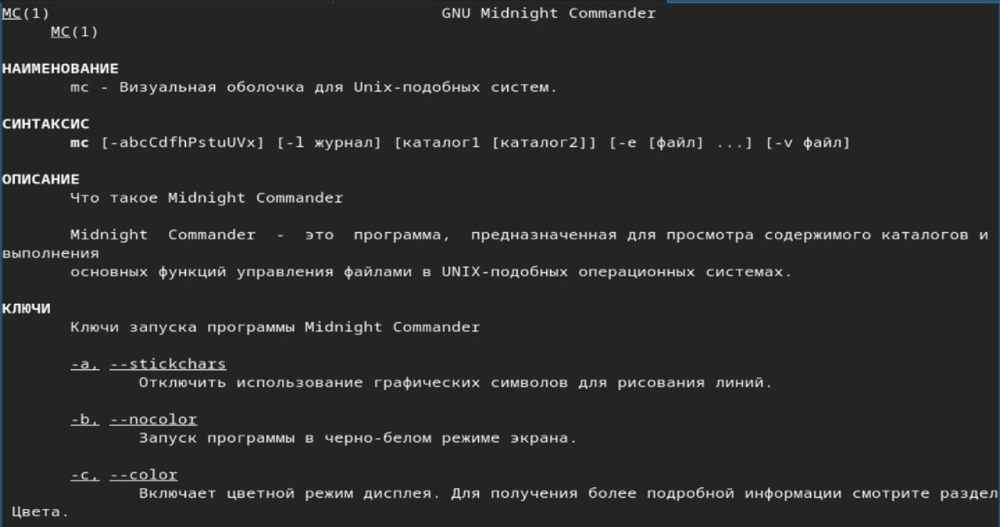
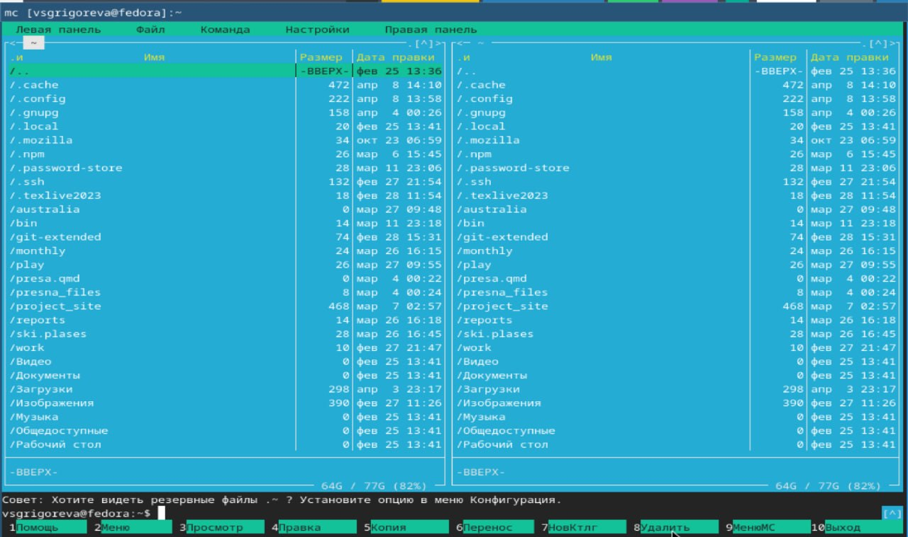
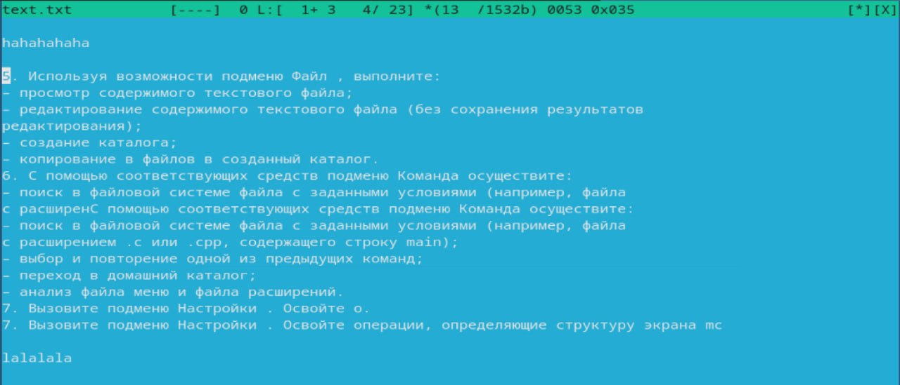
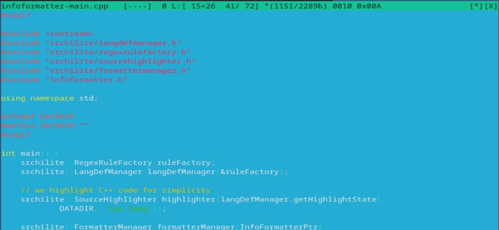

---
## Front matter
lang: ru-RU
title: Лабораторная работа №9
subtitle: Операционные системы
author:
  - Григорьева Валерия Сергеевна
institute:
  - Российский университет дружбы народов, Москва, Россия
date: 10 апреля 2026

## i18n babel
babel-lang: russian
babel-otherlangs: english

## Formatting pdf
toc: false
toc-title: Содержание
slide_level: 2
aspectratio: 169
section-titles: true
theme: metropolis
header-includes:
 - \metroset{progressbar=frametitle,sectionpage=progressbar,numbering=fraction}
---

# Информация

## Докладчик

:::::::::::::: {.columns align=center}
::: {.column width="70%"}

  * Григорьева Валерия Сергеевна
  * студентка НКАбд-02-25
  * Российский университет дружбы народов им. П.Лумумбы
  * [1032253494@rudn.ru](mailto:1032253494@rudn.ru)

:::
::: {.column width="30%"}

:::
::::::::::::::

## Цель работы 

Освоение основных возможностей командной оболочки Midnight Commander. Приобретение навыков практической работы по просмотру каталогов и файлов; манипуляций с ними.

## Теоретическое введение

Командная оболочка — интерфейс взаимодействия пользователя с операционной системой и программным обеспечением посредством команд. Midnight Commander (или mc) — псевдографическая командная оболочка для UNIX/Linux систем. Для запуска mc необходимо в командной строке набрать mc и нажать Enter. Рабочее пространство mc имеет две панели, отображающие по умолчанию списки файлов двух каталогов.

# Выполнение лабораторной работы

## Информация о mc

Для начала работы я изучите информацию о mc с помощью команды man.

{#fig-001 width=70%}

## Интерфейс редактора

Затем изучила структуру mc. Далее выполнила несколько операций в mc, используя управляющие клавиши, основные команды меню левой (или правой) панели, использовала возможности подменю Файл, Команда, Настройки.

{#fig-002 width=70%}

## Работа с текстовым файлом

Затем создала текстовой файл text.txt, открыла его в mc, вставила туда фрагмент текста и проделала с этим фрагментом некоторые манипуляции.

{#fig-003 width=70%}

## Работа с файлом .cpp

Далее я открыла файл с исходным текстом на некотором языке программирования с и включила подсветку синтаксиса.

{#fig-004 width=70%}
 
## Выводы

В результате выполнения лабораторной работы я освоила основные возможности командной оболочки Midnight Commander и приобрела навыки практической работы по просмотру каталогов и файлов; манипуляций с ними.
