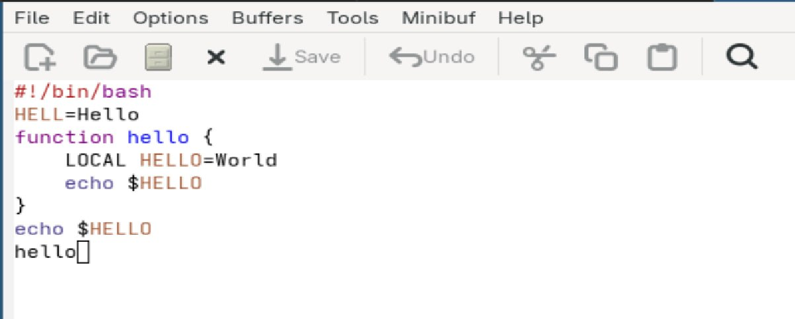

---
## Front matter
lang: ru-RU
title: Лабораторная работа №11
subtitle: Операционные системы
author:
  - Григорьева Валерия Сергеевна
institute:
  - Российский университет дружбы народов, Москва, Россия
date: 24 апреля 2026

## i18n babel
babel-lang: russian
babel-otherlangs: english

## Formatting pdf
toc: false
toc-title: Содержание
slide_level: 2
aspectratio: 169
section-titles: true
theme: metropolis
header-includes:
 - \metroset{progressbar=frametitle,sectionpage=progressbar,numbering=fraction}
---

# Информация

## Докладчик

:::::::::::::: {.columns align=center}
::: {.column width="70%"}

  * Григорьева Валерия Сергеевна
  * студентка НКАбд-02-25
  * Российский университет дружбы народов им. П.Лумумбы
  * [1032253494@rudn.ru](mailto:1032253494@rudn.ru)

:::
::: {.column width="30%"}

:::
::::::::::::::

## Цель работы 

Познакомиться с операционной системой Linux. Получить практические навыки работы с редактором Emacs.

## Теоретическое введение

Буфер — объект, представляющий какой-либо текст. Буфер может содержать что угодно, например, результаты компиляции программы или встроенные подсказки. Практически всё взаимодействие с пользователем, в том числе интерактивное, происходит посредством буферов. 
Фрейм соответствует окну в обычном понимании этого слова. Каждый фрейм содержит область вывода и одно или несколько окон Emacs. 
Окно — прямоугольная область фрейма, отображающая один из буферов. 
Область вывода — одна или несколько строк внизу фрейма, в которой Emacs выводит различные сообщения, а также запрашивает подтверждения и дополнительную информацию от пользователя. 
Минибуфер используется для ввода дополнительной информации и всегда отображается в области вывода. 
Точка вставки — место вставки (удаления) данных в буфере.

# Выполнение лабораторной работы

## Emacs

Для начала работы я скачала и открыла emacs.

## Создание файла

Затем я создала файл, набрала в нем текст и сохранила его.

## Работа с файлом

Затем я проделала с текстом стандартные процедуры редактирования, каждое действие осуществлялось комбинацией клавиш, например, чтобы вырезать одной командой целую строку, я нажала комбинацию С-k. Затем я научилась пользоваться комнадами по перемещению курсора.

## 4 части фрейма

Далее я вывела список активных буферов на экран и переключалась между окнами. Затем я поделила фрейм на 4 части, в каждом из четырёх созданных окон открыла новый буфер (файл) и ввела несколько строк текста .

{#fig-003 width=50%}

## Режим поиска

Затем я переключилась в режим поиска (C-s) и нашла несколько слов, присутствующих в тексте. Далее перешла в поиска и замены (M-%) и ввела текст, который следует найти и заменить. Затем попробовала другой режим поиска, нажав M-s o. Он отличается тем, что показывает все совпадения в отдельном окне.

## Выводы

В ходе выполнения лабораторной работы я получила практические навыки работы с редактором Emacs.
