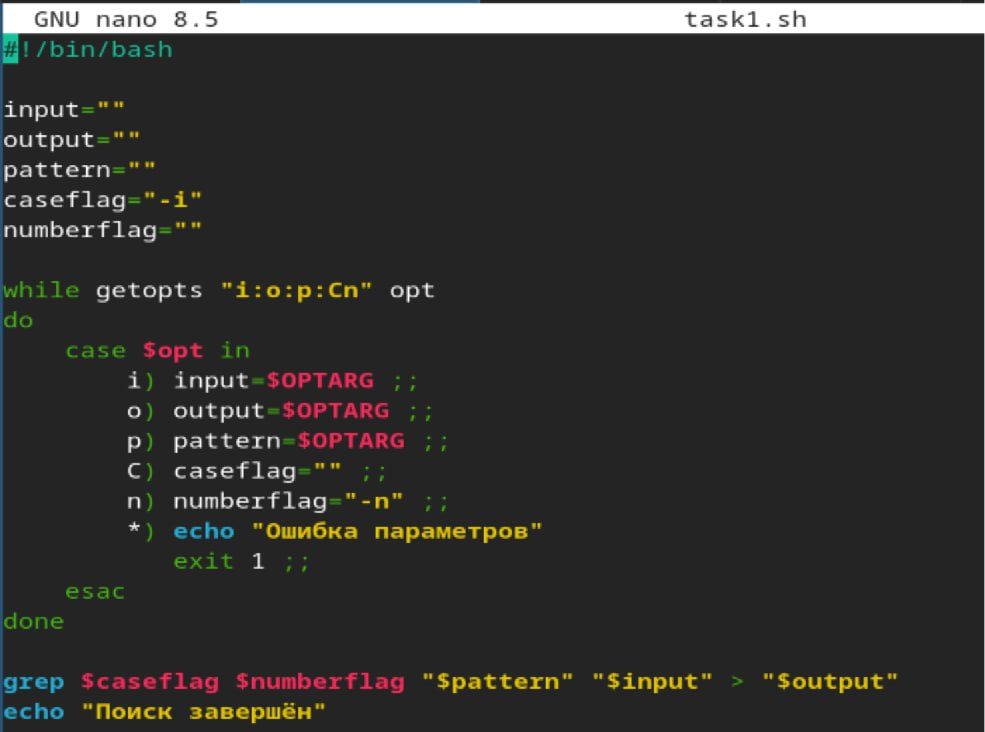
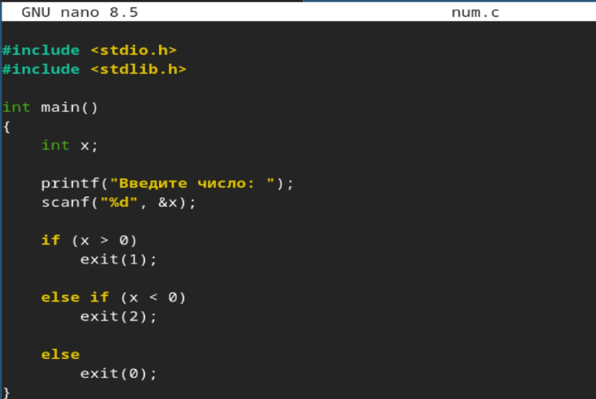
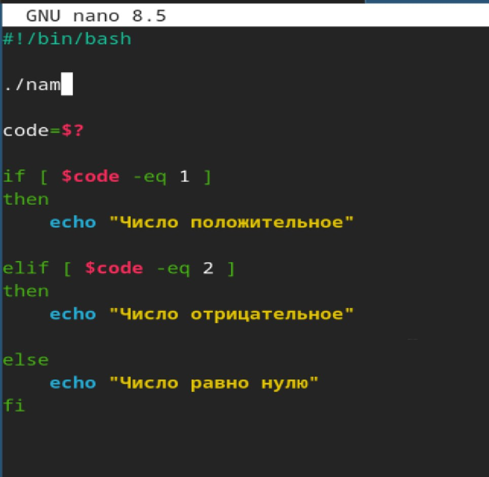
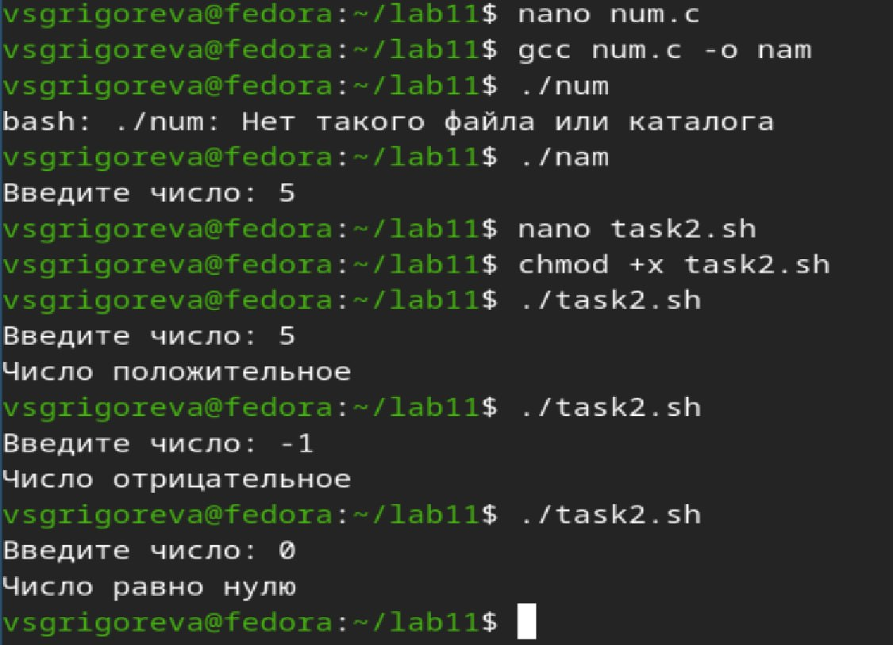
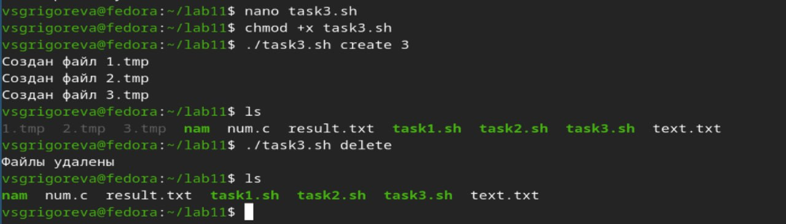
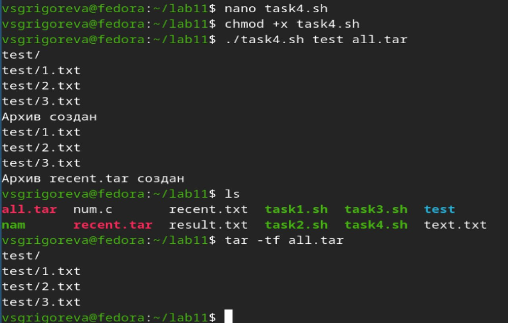

---
## Front matter
lang: ru-RU
title: Лабораторная работа №13
subtitle: Операционные системы
author:
  - Григорьева Валерия Сергеевна
institute:
  - Российский университет дружбы народов, Москва, Россия
date: 8 мая 2026

## i18n babel
babel-lang: russian
babel-otherlangs: english

## Formatting pdf
toc: false
toc-title: Содержание
slide_level: 2
aspectratio: 169
section-titles: true
theme: metropolis
header-includes:
 - \metroset{progressbar=frametitle,sectionpage=progressbar,numbering=fraction}
---

# Информация

## Докладчик

:::::::::::::: {.columns align=center}
::: {.column width="70%"}

  * Григорьева Валерия Сергеевна
  * студентка НКАбд-02-25
  * Российский университет дружбы народов им. П.Лумумбы
  * [1032253494@rudn.ru](mailto:1032253494@rudn.ru)

:::
::: {.column width="30%"}

:::
::::::::::::::

## Цель работы 

Изучить основы программирования в оболочке ОС UNIX. Научится писать более сложные командные файлы с использованием логических управляющих конструкций и циклов.

## Теоретическое введение

Bash (Bourne Again Shell) — это мощная командная оболочка Unix, которая используется для выполнения различных задач в терминале. Bash предоставляет интерактивный интерфейс, в котором пользователи могут вводить команды, а затем получать результаты. Она также поддерживает скрипты оболочки, которые представляют собой текстовые файлы, содержащие последовательность команд Bash для автоматизации задач. 

Bash может обрабатывать как простые, так и сложные команды. Оболочка предоставляет функции расширенного ввода, такие как автодополнение, которое предлагает возможные варианты завершения команд и имен файлов по мере их ввода. Она также поддерживает историю, позволяя пользователям просматривать ранее введенные команды, а затем повторно их использовать. 

# Выполнение лабораторной работы

## Программа 1

Сначала я написала командный файл, который анализирует командную строку с ключами, а затем ищет в указанном файле нужные строки, определяемые ключом -р.

{#fig-001 width=50%}

## Запуск программы 1

Затем я сделала файл исполняемым и запустила его.

## Программа 2

Дале я написала на Си программу, которая вводит число и определяет, является ли оно больше нуля, меньше нуля или равно нулю. Далее создала командный файл, который вызывает эту программу и выдает сообщение о том, какое число было введено.

:::::::::::::: {.columns align=center}
::: {.column width="60%"}

{#fig-003 width=60%}

:::
::: {.column width="60%"}

{#fig-004 width=60%}

:::
::::::::::::::

## Запуск программы 2

Затем я сделала файл исполняемым и запустила его.

{#fig-005 width=60%}

## Программа 3

Далее я написала командный файл, создающий указанное число файлов, пронумерованных последовательно от 1 до N (например 1.tmp, 2.tmp, 3.tmp,4.tmp и т.д.). Этот же командный файл умеет удалять все созданные им файлы (если они существуют).

{#fig-006 width=40%}

## Запуск программы 3

Затем я сделала файл исполняемым и запустила его.

## Программа 4

Далее я написала командный файл, который с помощью команды tar запаковывает в архив все файлы в указанной директории и модифицировала его так, чтобы запаковывались только те файлы, которые были изменены менее недели тому назад.

{#fig-008 width=50%}

## Запуск программы 4

Затем я сделала файл исполняемым и запустила его.

{#fig-009 width=50%}

## Выводы

В результате проведенной работы я изучила основы программирования в оболочке ОС UNIX, научилась писать более сложные командные файлы с использованием логических управляющих конструкций и циклов.

