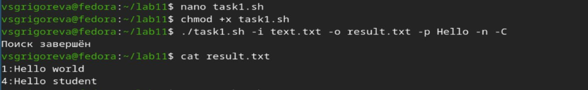
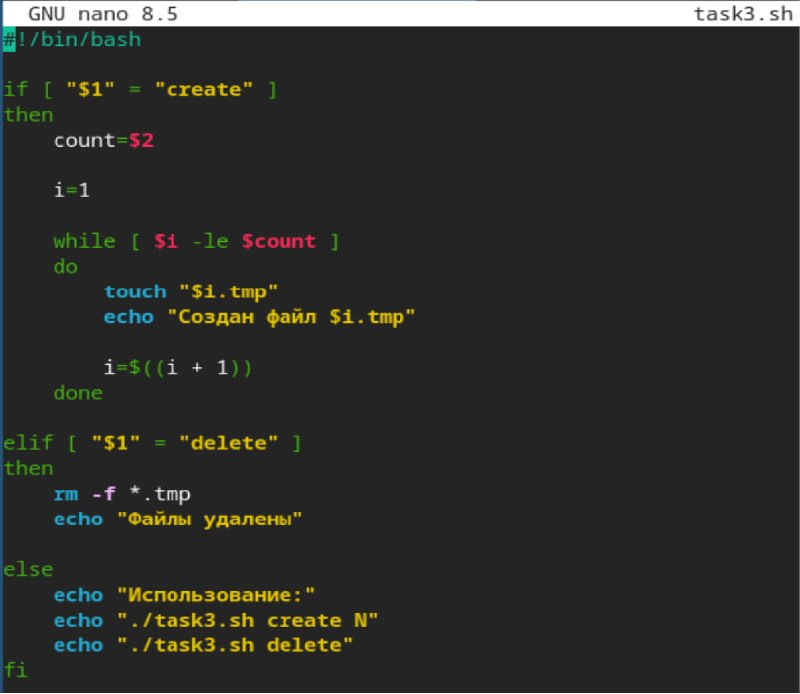
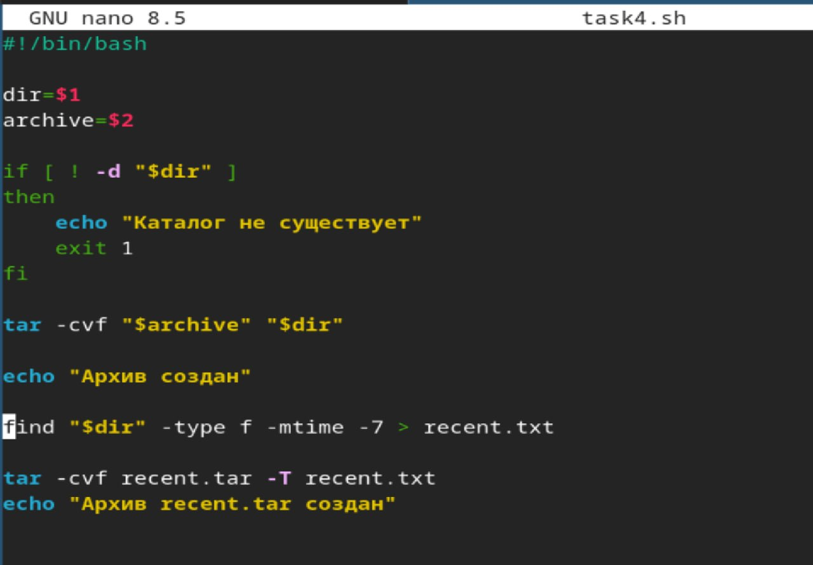

---
## Author
author:
  name: Валерия Сергеевна Григорьева
  degrees: DSc
  orcid: 0000-0002-0877-7063
  email: 1032253494@rudn.ru
  affiliation:
    - name: Российский университет дружбы народов
      country: Российская Федерация
      postal-code: 117198
      city: Москва
      address: ул. Миклухо-Маклая, д. 6

## Title
title: "Лабораторная работа №13"
subtitle: "по дисциплине: Архитектура компьютеров"
license: "CC BY"
---

# Цель работы

Изучить основы программирования в оболочке ОС UNIX. Научится писать более сложные командные файлы с использованием логических управляющих конструкций и циклов.

# Задание

1. Используя команды getopts grep, написать командный файл, который анализирует командную строку с ключами: -iinputfile — прочитать данные из указанного файла; -ooutputfile — вывести данные в указанный файл; -pшаблон — указать шаблон для поиска; -C — различать большие и малые буквы; -n — выдавать номера строк. А затем ищет в указанном файле нужные строки, определяемые ключом -p.

2. Написать на языке Си программу, которая вводит число и определяет, является ли оно больше нуля, меньше нуля или равно нулю. Затем программа завершается с помощью функции exit(n), передавая информацию в о коде завершения в оболочку. Командный файл должен вызывать эту программу и, проанализировав с помощью команды $?, выдать сообщение о том, какое число было введено.

3. Написать командный файл, создающий указанное число файлов, пронумерованных последовательно от 1 до 𝑁 (например 1.tmp, 2.tmp, 3.tmp,4.tmp и т.д.). Число файлов, которые необходимо создать, передаётся в аргументы командной строки. Этот же командный файл должен уметь удалять все созданные им файлы (если они существуют).

4. Написать командный файл, который с помощью команды tar запаковывает в архив все файлы в указанной директории. Модифицировать его так, чтобы запаковывались только те файлы, которые были изменены менее недели тому назад (использовать команду find).

# Теоретическое введение

Bash (Bourne Again Shell) — это мощная командная оболочка Unix, которая используется для выполнения различных задач в терминале. Bash предоставляет интерактивный интерфейс, в котором пользователи могут вводить команды, а затем получать результаты. Она также поддерживает скрипты оболочки, которые представляют собой текстовые файлы, содержащие последовательность команд Bash для автоматизации задач. Bash широко используется в средах Unix и Linux, а также поддерживается Windows с помощью подсистемы Windows для Linux (WSL). Перечислим основные возможности этой оболочки. Обработка команд. Bash может обрабатывать как простые, так и сложные команды. Простые состоят из одного действия и, возможно, некоторых аргументов. Сложные команды могут содержать несколько простых, объединенных с помощью операторов конвейера (|), перенаправления ввода и вывода (<, >, >>), условных операторов (if/else, case/esac, while/do). О них мы расскажем позже. Расширенный ввод, редактирование строк. Оболочка предоставляет функции расширенного ввода, такие как автодополнение, которое предлагает возможные варианты завершения команд и имен файлов по мере их ввода. Она также поддерживает историю, позволяя пользователям просматривать ранее введенные команды, а затем повторно их использовать. Возможность создания и запуска скриптов. Скрипты оболочки — это текстовые файлы, содержащие последовательность команд. Их можно создавать с помощью текстового редактора, а затем запускать в терминале, что дает возможность пользователям автоматизировать задачи и управлять системой. Скрипты могут содержать условные операторы, циклы, функции для обеспечения дополнительной гибкости и контроля.

# Выполнение лабораторной работы

Сначала я, используя команды getopts grep, написала командный файл, который анализирует командную строку с ключами: -iinputfile — прочитать данные из указанного файла; -ooutputfile — вывести данные в указанный файл; -pшаблон — указать шаблон для поиска; -C — различать большие и малые буквы; -n — выдавать номера строк. А затем ищет в указанном файле нужные строки, определяемые ключом -р ([рис. @fig-001]).

{#fig-001 width=70%}

Затем я сделала файл исполняемым и запустила его ([рис. @fig-002]).

{#fig-002 width=70%}

Дале я написала на языке Си программу, которая вводит число и определяет, является ли оно больше нуля, меньше нуля или равно нулю. Затем программа завершается с помощью функции exit(n), передавая информацию в о коде завершения в оболочку ([рис. @fig-003]).

{#fig-003 width=70%}

Затем я создала командный файл, который вызывает эту программу и выдает сообщение о том, какое число было введено ([рис. @fig-004]).

{#fig-004 width=70%}

Затем я сделала файл исполняемым и запустила его ([рис. @fig-005]).

{#fig-005 width=70%}

Далее я написала командный файл, создающий указанное число файлов, пронумерованных последовательно от 1 до 𝑁 (например 1.tmp, 2.tmp, 3.tmp,4.tmp и т.д.). Этот же командный файл умеет удалять все созданные им файлы (если они существуют) ([рис. @fig-006]).

{#fig-006 width=70%}

Затем я проверила работу этой программы ([рис. @fig-007]).

{#fig-007 width=70%}

Далее я написала командный файл, который с помощью команды tar запаковывает в архив все файлы в указанной директории и модифицировала его так, чтобы запаковывались только те файлы, которые были изменены менее недели тому назад (использовать команду find) ([рис. @fig-008]).

{#fig-008 width=70%}

Затем я проверила работу программы ([рис. @fig-009]).

{#fig-009 width=70%}

# Выводы

В результате проведенной работы я изучила основы программирования в оболочке ОС UNIX, научилась писать более сложные командные файлы с использованием логических управляющих конструкций и циклов.

# Список литературы{.unnumbered}

::: {#refs}
:::
