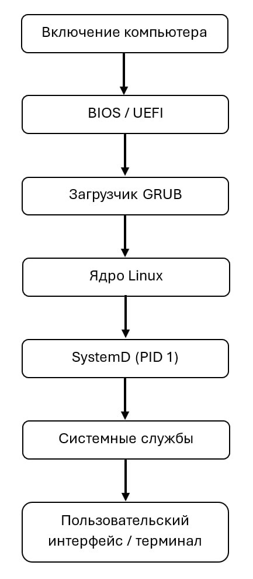

---
## Author
author:
  name: Валерия Сергеевна Григорьева
  degrees: DSc
  orcid: 0000-0002-0877-7063
  email: 1032253494@rudn.ru
  affiliation:
    - name: Российский университет дружбы народов
      country: Российская Федерация
      postal-code: 117198
      city: Москва
      address: ул. Миклухо-Маклая, д. 6
## Title
title: Система инициализации SystemD
subtitle: Архитектура компьютеров и операционные системы
license: CC BY
date: today
date-format: "YYYY-MM-DD" # Example: 2025-09-06
---

# Информация

## Докладчик

:::::::::::::: {.columns align=center}
::: {.column width="70%"}

  * Григорьева Валерия Сергеевна
  * студентка НКАбд-02-25
  * Российский университет дружбы народов им. П.Лумумбы
  * [1032253494@rudn.ru](mailto:1032253494@rudn.ru)

:::
::: {.column width="30%"}

:::
::::::::::::::

# Вводная часть

## Введение

Акутальность: в рамках изучения операционных систем важно понимать, как именно происходит запуск и организация работы компьютера после его включения. Система инициализации SystemD является неотъемлемой частью большинства современных Linux-систем и отвечает за управление службами и процессами. Изучение её принципов работы позволяет лучше понять внутреннее устройство операционной системы.

Объект исследования — операционные системы семейства Linux. 

Предмет исследования — система инициализации SystemD, её архитектура, функции и принципы работы.

## Введение

Научная новизна работы заключается в систематизации и анализе современных подходов к инициализации операционных систем на примере SystemD, а также в рассмотрении её архитектурных особенностей по сравнению с традиционными системами инициализации.

Полученные знания могут быть использованы: при администрировании Linux-систем; при настройке и оптимизации служб; при разработке программного обеспечения, взаимодействующего с системными сервисами.

В работе использовались учебные и справочные материалы по операционным системам, а также документация по SystemD.

Основными методами исследования являются анализ информации и сравнительный подход. В качестве инструментов применялись средства командной строки Linux и утилиты управления службами.

Теоретическую основу составляют знания в области операционных систем и системного администрирования.

## Введение

Цель работы — изучить систему инициализации SystemD, её функции и особенности реализации.

Гипотеза — использование современной системы инициализации SystemD повышает эффективность, стабильность и управляемость операционной системы по сравнению с устаревшими решениями.

Задачи исследования:

1. Изучить понятие системы инициализации.

2. Проанализировать архитектуру и принципы работы SystemD.

3. Выявить преимущества и недостатки SystemD.

4. Оценить её роль в современных операционных системах.

# Основная часть

## Что такое система инициализации SystemD

Init System (система инициализации) — это компонент операционной системы, который отвечает за запуск системных служб и процессов, управление их состоянием, обеспечением корректной работы системы в процессе эксплуатации. Этот процесс имеет идентификатор PID 1.

SystemD - это современная система инициализации и управления службами. Её можно рассматривать как комплексную систему управления всей средой выполнения операционной системы.

Первые версии SystemD были созданы в результате сотрудничества Леннарта Пёттеринга и Кая Зиверса. С 2011 года Fedora стал первым крупным дистрибутивом, использующим systemd по умолчанию.

## Особенности SystemD

1. Параллельная загрузка служб на основе зависимостей. 

2. Управление через юниты (units). Основные типы юнитов: service (.service), socket (.socket), timer (.timer) и др.

3. Управление зависимостями. 

4. Централизованное управление. Для управления используется команда systemctl. 

5. Включает собственную систему журналирования - journald. 

6. Автоматическое восстановление. 

7. Механизм таймеров. 

## Принцип работы SystemD

{#fig-002 width=70%}

## Преимущества и недостатки SystemD

:::::::::::::: {.columns align=center}
::: {.column width="70%"}

Преимущества: 

- высокая скорость загрузки, 

- удобство управления, 

- продвинутое логирование, 

- автоматизация процессов, 

- единый механизм для управления системой, 

- стабильность работы 

:::
::: {.column width="70%"}

Недостатки: 

- высокая сложность и большое количество функций, 

- нарушение философии Unix (делать одну вещь и делать ее хорошо), 

- дыры в безопасности. 

:::
::::::::::::::

# Заключение

SystemD - мощная и современная система инициализации, которая значительно упростила управление операционной системы Linux. Она обеспечивает быстрый запуск системы и удобное управление службами. 

Несмотря на существующую критику, SystemD широко используется и продолжнает развиваться, оставаясь важным компонентом современной ИТ-инфраструктуры.

