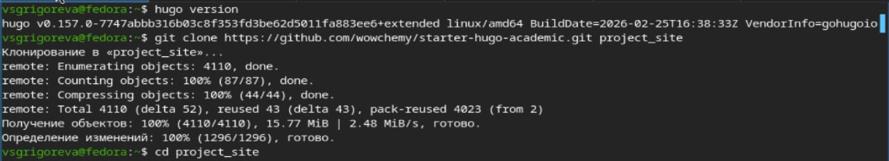
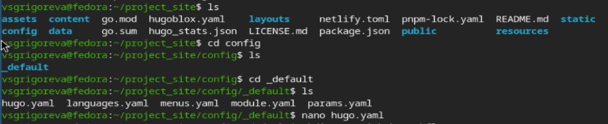
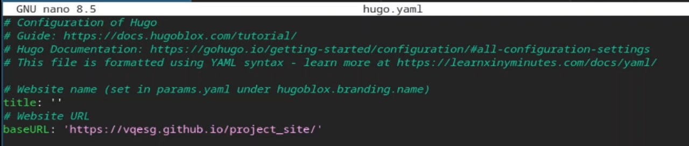
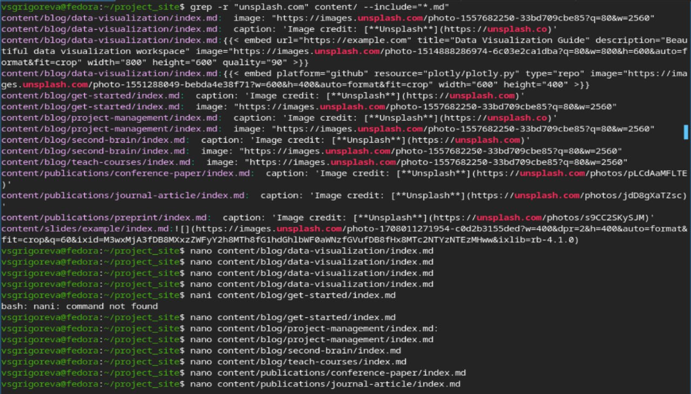
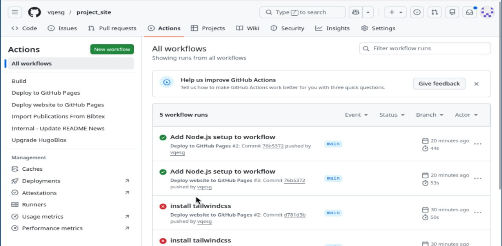

---
## Front matter
lang: ru-RU
title: Индивидуальный проект. Этап 1
subtitle: Операционные системы
author:
  - Григорьева Валерия Сергеевна
institute:
  - Российский университет дружбы народов, Москва, Россия
date: 07 марта 2026

## i18n babel
babel-lang: russian
babel-otherlangs: english

## Formatting pdf
toc: false
toc-title: Содержание
slide_level: 2
aspectratio: 169
section-titles: true
theme: metropolis
header-includes:
 - \metroset{progressbar=frametitle,sectionpage=progressbar,numbering=fraction}
---

# Информация

## Докладчик

:::::::::::::: {.columns align=center}
::: {.column width="70%"}

  * Григорьева Валерия Сергеевна
  * студентка НКАбд-02-25
  * Российский университет дружбы народов им. П.Лумумбы
  * [1032253494@rudn.ru](mailto:1032253494@rudn.ru)

:::
::: {.column width="30%"}

:::
::::::::::::::

## Цель работы 

Научиться размещать сайт на Github pages, выполнить первый этап индивидуального проекта.

## Задание

- Установка необходимого ПО

- Скачивание шаблона темы сайта

- Размещение его на хостинге Git

- Установка параметра URL для сайта

- Размещение заготовки сайта на Github Pages

# Выполнение лабораторной работы

## Создание локального репозитория

Для начала работы я установила необходимое ПО (Go, Hugo). Затем я клонировала репозиторий шаблона и перешла в созданный каталог с репозиторием.

{#fig-001 width=50%}

## Создание репозитория на Github

Далее на Github я создала новый репозиторий. Затем я подключила к Github существующий локальный репозиторий. После push я проверила репозиторий на Github: файлы появились.

{#fig-002 width=50%}

## Настроила baseURL

Затем я настроила baseURL. Для этого открыла файл hugo.yaml.

{#fig-003 width=50%}

И затем изменила строку baseURL.

{#fig-004 width=50%}

## Создание и редактирование файла gh-pages.yml

Затем я создала папку для workflows, а в ней создала файл gh-pages.yml и открыла его. Затем ввела в него нужный текст.

{#fig-005 width=50%} 

{#fig-006 width=50%}

## Изменение файлов с Unsplash

Далее я нашла все файлы, где вставлены картинки с Unsplash, отредактировала их все, удалив строки с Unsplash, так как это могло вызвать ошибки при сборке.

{#fig-007 width=50%}

## Проверка и установка нужного ПО

Далее я проверила, что необходимое для сборки ПО установлено, и установила Tailwindcss.

{#fig-008 width=50%}

## Сборка локального сайта

Затем с помощью команды hugo server я запустила локальный сервер, а затем проверила, что сайт собрался корректно.

{#fig-009 width=50%}

## Отправка на Github

Затем я отправила все изменения на Github.

{#fig-010 width=50%}

## Настройка сайта на Github

Далее я перешла в настройки репозитория на Github, открыла страницу Pages и выбрала Github Actions.

{#fig-011 width=50%}

Затем я перезапустила последние workflows во вкладке Actions на Github.

{#fig-012 width=50%}

## Проверка работы сайта

И далее проверила в браузере, что сайт работает.

{#fig-013 width=70%}

## Выводы

В процессе выполнения первого этапа индивидуального проекта я научилась размещать сайт на Github pages.
