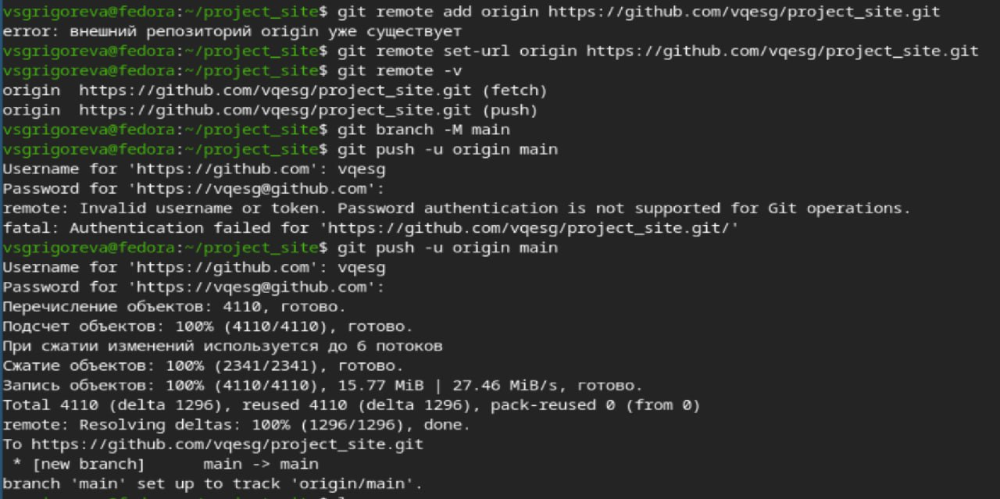
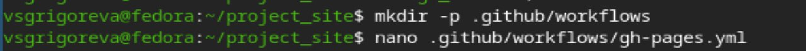
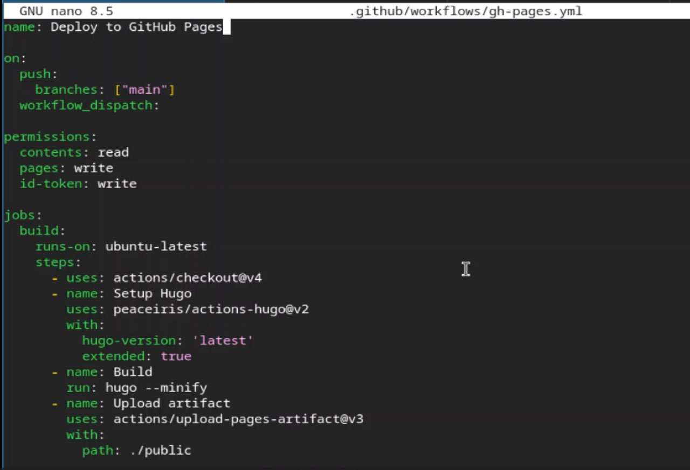
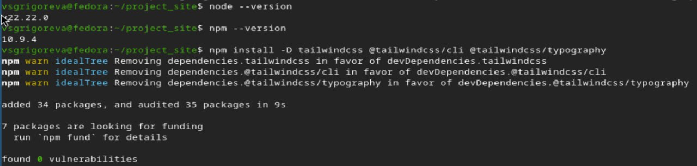
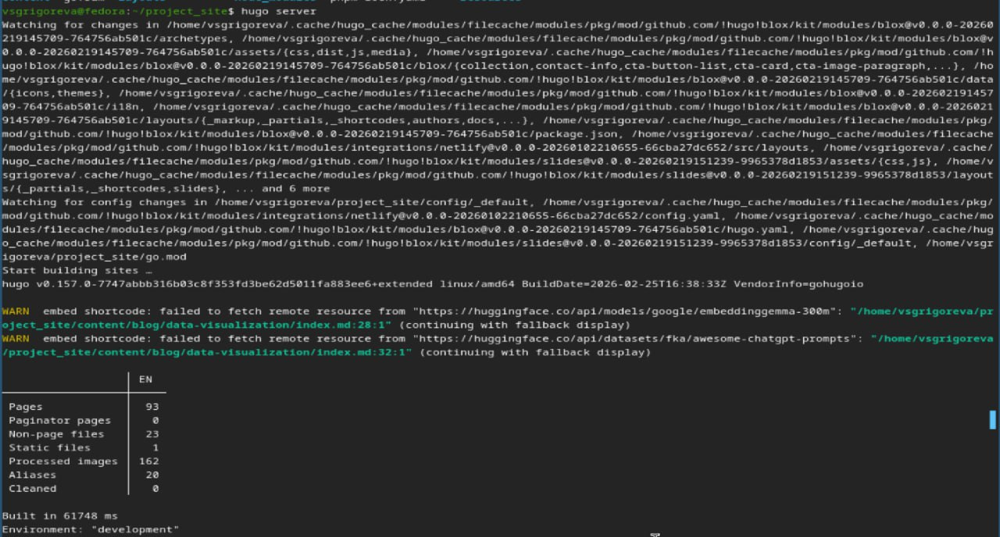
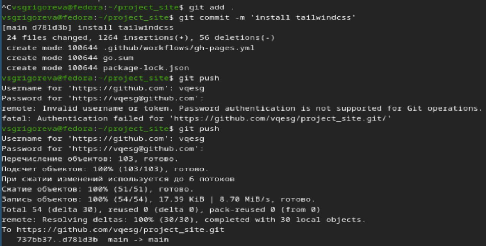
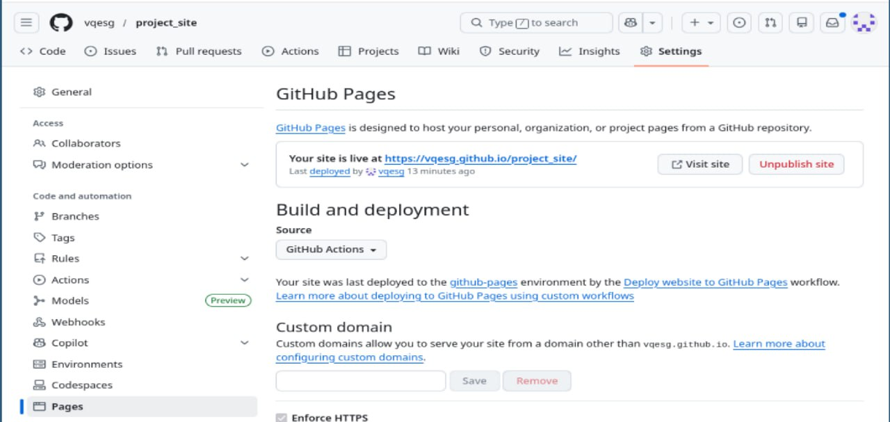

---
## Author
author:
  name: Валерия Сергеевна Григорьева
  degrees: DSc
  orcid: 0000-0002-0877-7063
  email: 1032253494@rudn.ru
  affiliation:
    - name: Российский университет дружбы народов
      country: Российская Федерация
      postal-code: 117198
      city: Москва
      address: ул. Миклухо-Маклая, д. 6

## Title
title: "Индивидуальный проект: этап 1"
subtitle: "дисциплина: Архитектура компьютера"
license: "CC BY"
---

# Цель работы

Научиться размещать сайт на Github pages, выполнить первый этап индивидуального проекта.

# Задание

- Установка необходимого ПО

- Скачивание шаблона темы сайта

- Размещение его на хостинге Git

- Установка параметра URL для сайта

- Размещение заготовки сайта на Github Pages

# Выполнение лабораторной работы

Для начала работы я установила необходимое ПО (Go, Hugo). Затем я клонировала репозиторий шаблона и перешла в созданный каталог с репозиторием ([рис. @fig-001]).

{#fig-001 width=70%}

Далее на Github я создала новый репозиторий. Затем я подключила к Github существующий локальный репозиторий ([рис. @fig-002]). После push я проверила репозиторий на Github: файлы появились.

{#fig-002 width=70%}

Затем я настроила baseURL. Для этого открыла файл hugo.yaml ([рис. @fig-003]).

{#fig-003 width=70%}

И затем изменила строку baseURL ([рис. @fig-004]).

{#fig-004 width=70%}

Затем я создала папку для workflows, а в ней создала файл gh-pages.yml и открыла его ([рис. @fig-005]). Затем ввела в него нужный текст ([рис. @fig-006]).

{#fig-005 width=70%} 

{#fig-006 width=70%}

Далее я нашла все файлы, где вставлены картинки с Unsplash, отредактировала ихх все, удалив строки с Unsplash, так как это могло вызвать ошибки при сборке ([рис. @fig-007]).

{#fig-007 width=70%}

Далее я проверила, что необходимое для сборки ПО установлено, и установила Tailwindcss ([рис. @fig-008]).

{#fig-008 width=70%}

Затем с помощью команды hugo server я запустила локальный сервер, а затем проверила, что сайт собрался корректно ([рис. @fig-009]).

{#fig-009 width=70%}

Затем я отправила все изменения на Github ([рис. @fig-010]).

{#fig-010 width=70%}

Далее я перешла в настройки репозитория на Github, открыла страницу Pages и выбрала Github Actions ([рис. @fig-011]).

{#fig-011 width=70%}

Затем я перезапустила последние workflows во вкладке Actions на Github ([рис. @fig-012]).

{#fig-012 width=70%}

И далее проверила в браузере, что сайт работает ([рис. @fig-013]).

{#fig-013 width=70%}

# Выводы

В процессе выполнения первого этапа индивидуального проекта я научилась размещать сайт на Github pages.

# Список литературы{.unnumbered}

::: {#refs}
:::
