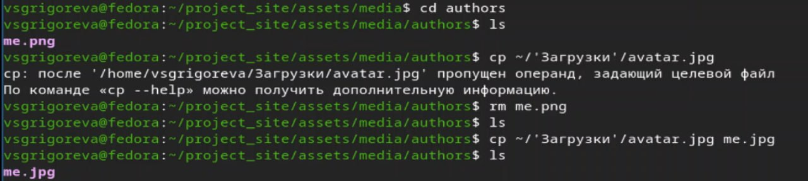
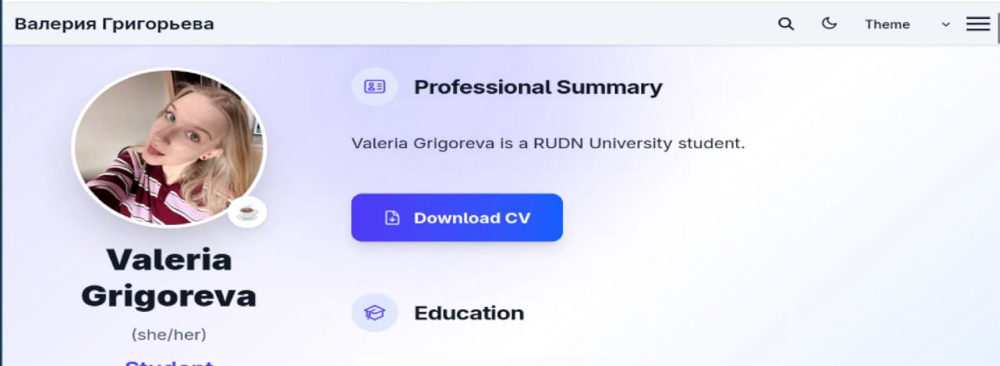
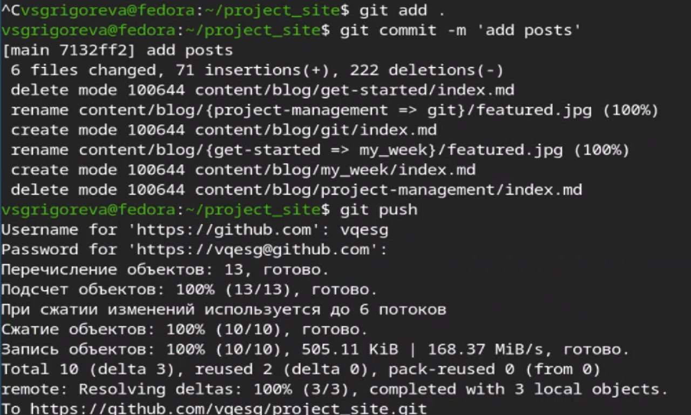

---
## Front matter
lang: ru-RU
title: Индивидуальный проект. Этап 2
subtitle: Операционные системы
author:
  - Григорьева Валерия Сергеевна
institute:
  - Российский университет дружбы народов, Москва, Россия
date: 20 марта 2026

## i18n babel
babel-lang: russian
babel-otherlangs: english

## Formatting pdf
toc: false
toc-title: Содержание
slide_level: 2
aspectratio: 169
section-titles: true
theme: metropolis
header-includes:
 - \metroset{progressbar=frametitle,sectionpage=progressbar,numbering=fraction}
---

# Информация

## Докладчик

:::::::::::::: {.columns align=center}
::: {.column width="70%"}

  * Григорьева Валерия Сергеевна
  * студентка НКАбд-02-25
  * Российский университет дружбы народов им. П.Лумумбы
  * [1032253494@rudn.ru](mailto:1032253494@rudn.ru)

:::
::: {.column width="30%"}

:::
::::::::::::::

## Цель работы

Целью работы было добавить к сайту данные о себе и опубликовать посты.

## Задание

1. Разместить фотографию владельца сайта. Разместить краткое описание владельца сайта (Biography). Добавить информацию об интересах (Interests). Добавить информацию от образовании (Education).

2. Сделать пост по прошедшей неделе.

3. Добавить пост на тему по выбору: управление версиями, непрерывная интеграция и непрерывное развертывание (CI/CD).

# Выполнение лабораторной работы

## Добавление аватарки

В начале работы я добавила свою аватарку вместо чуществующей чужой.

## Добавиление информации о себе 

Затем в папке data/authors в файле me.yaml я добавила информацию о себе: имя, фамилию, интересы, биографию, обучение.

## Сайт 

Далее я проверила, что все изменения применились, и собрала сайт с помощью команды hugo server. Сайт теперь содержит информацию обо мне. Затем я отправила зменения на гитхаб.

## Пост о прошедшей неделе

Затем в файле content/blog/get-started/index.md я изменила текст поста на свой текст о прошедшей неделе. Также я написала пост о git. 

## Отправка изменения на github

Затем проверила, что локальный сайт собрался правильно, и после этого отправила изменения на гитхаб.

## Посты

Вот мой пост о git.

{#fig-006 width=50%}

и о прошедшей неделе.

{#fig-007 width=50%}

## Выводы

В результате выполнения данного этапа индивидульного проекта я добавила на сайт информацию о себе и опубликовала посты.
