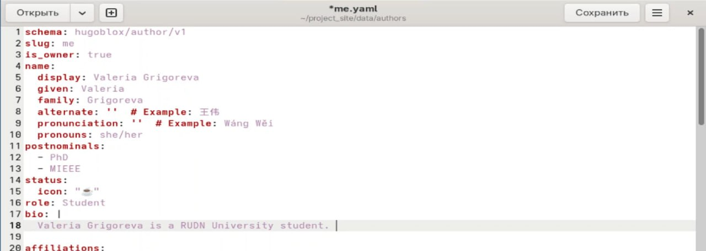
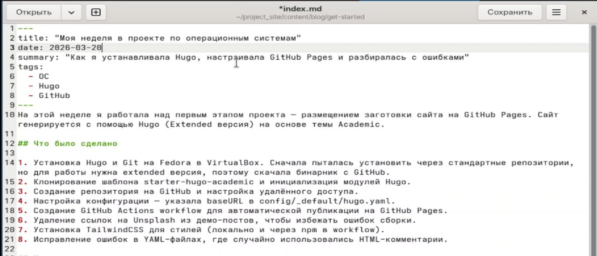
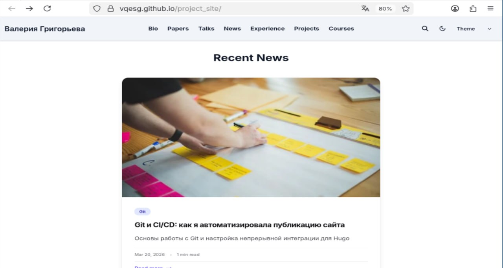
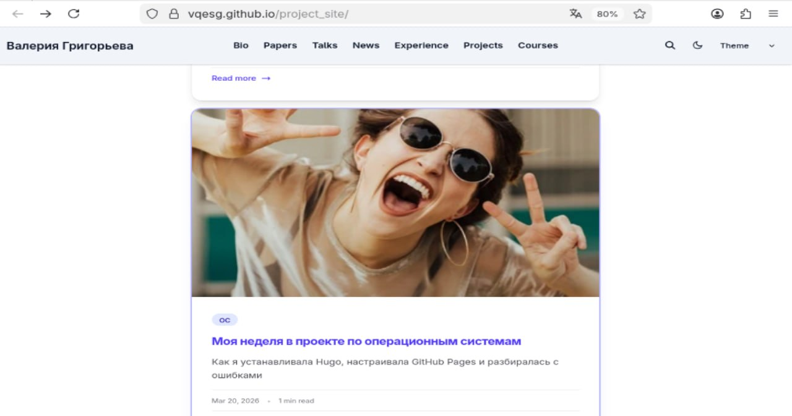

---
## Author
author:
  name: Валерия Сергеевна Григорьева
  degrees: DSc
  orcid: 0000-0002-0877-7063
  email: 1032253494@rudn.ru
  affiliation:
    - name: Российский университет дружбы народов
      country: Российская Федерация
      postal-code: 117198
      city: Москва
      address: ул. Миклухо-Маклая, д. 6

## Title
title: "Индивидуальный проект: этап 2"
subtitle: "дисциплина: Архитектура компьютера"
license: "CC BY"
---

# Цель работы

Целью работы было добавить к сайту данные о себе и опубликовать посты.

# Задание

1. Список добавляемых данных.

- Разместить фотографию владельца сайта.

- Разместить краткое описание владельца сайта (Biography).

- Добавить информацию об интересах (Interests).

- Добавить информацию от образовании (Education).

2. Сделать пост по прошедшей неделе.

3. Добавить пост на тему по выбору: управление версиями, непрерывная интеграция и непрерывное развертывание (CI/CD).

# Выполнение лабораторной работы

В начале работы я добавилаа свою аватарку вместо чуществующей чужой ([рис. @fig-001]).

{#fig-001 width=70%}

Затем в папке data/authors в файле me.yaml я добавила информацию о себе: имя, фамилию, интересы, биографию, обучение  ([рис. @fig-002]).

{#fig-002 width=70%}

Далее я проверила, что все изменения применились, и собрала сайт с помощью команды hugo server. Сайт теперь содержит информацию обо мне  ([рис. @fig-003]). Затем я отправила зменения на гитхаб.

{#fig-003 width=70%}

Затем в файле content/blog/get-started/index.md я изменила текст поста на свой текст о прошедшей неделе ([рис. @fig-004]). Также я написала пост о git. 

{#fig-004 width=70%}

Затем проверила, что локальный сайт собрался правильно, и после этого отправила изменения на гитхаб ([рис. @fig-005]).

{#fig-005 width=70%}

Вот мой пост о git ([рис. @fig-006]).

{#fig-006 width=70%}

и о прошедшей неделе ([рис. @fig-007]).

{#fig-007 width=70%}

# Выводы

В результате выполнения данного этапа индивидульного проекта я добавила на сайт информацию о себе и опубликовала посты.

# Список литературы{.unnumbered}

::: {#refs}
:::
