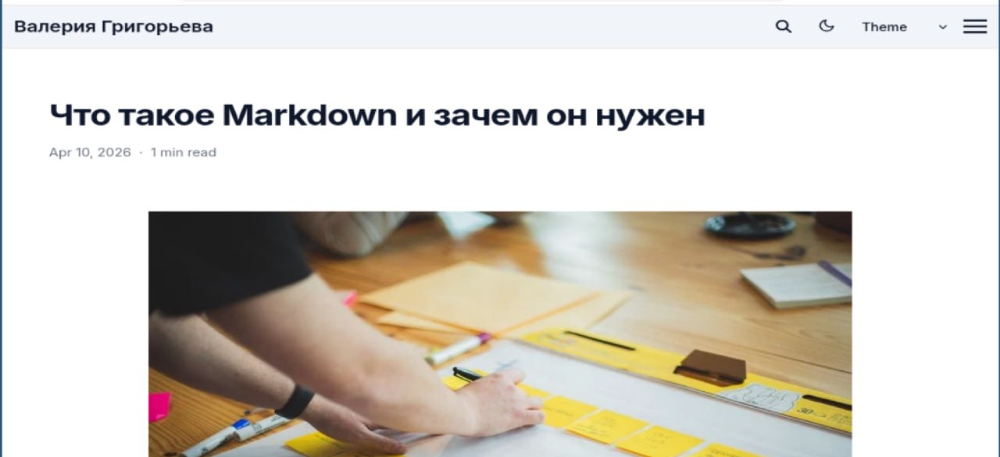

---
## Front matter
lang: ru-RU
title: Индивидуальный проект. Этап 3
subtitle: Операционные системы
author:
  - Григорьева Валерия Сергеевна
institute:
  - Российский университет дружбы народов, Москва, Россия
date: 10 апреля 2026

## i18n babel
babel-lang: russian
babel-otherlangs: english

## Formatting pdf
toc: false
toc-title: Содержание
slide_level: 2
aspectratio: 169
section-titles: true
theme: metropolis
header-includes:
 - \metroset{progressbar=frametitle,sectionpage=progressbar,numbering=fraction}
---

# Информация

## Докладчик

:::::::::::::: {.columns align=center}
::: {.column width="70%"}

  * Григорьева Валерия Сергеевна
  * студентка НКАбд-02-25
  * Российский университет дружбы народов им. П.Лумумбы
  * [1032253494@rudn.ru](mailto:1032253494@rudn.ru)

:::
::: {.column width="30%"}

:::
::::::::::::::

## Цель работы

Целью работы было добавить к сайту достижения и опубликовать посты.

## Добавление информации

В начале работы я в папке data/authors в файле me.yaml и в файле _index.md добавила информацию о навыках, опыте и достижениях.

{#fig-001 width=70%}

## Текст поста о Markdown

Затем в каталоге content/blog я добавила подкаталоги с новыми постами прошедшей неделе и о языке разметки Markdown.

{#fig-002 width=70%}

## Мой новый пост

Далее я проверила, что все изменения применились, и собрала сайт с помощью команды hugo server. Сайт теперь содержит информацию обо мне и мои новые посты. Затем я отправила зменения на гитхаб.

{#fig-003 width=70%}

## Выводы

В результате выполнения данного этапа индивидульного проекта я добавила на сайт информацию о своих достижениях и опубликовала посты.

