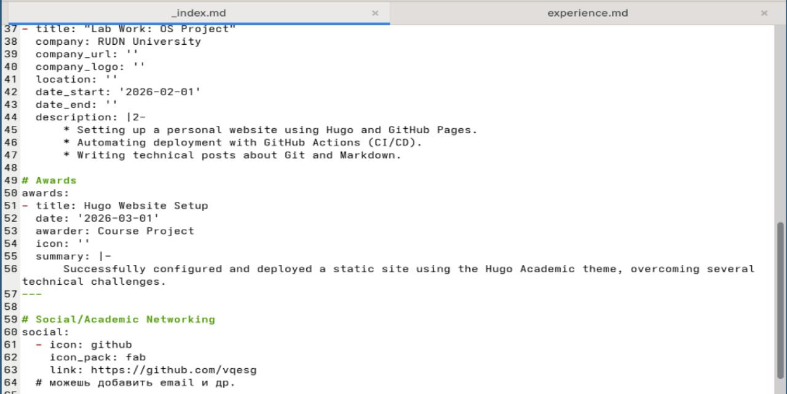
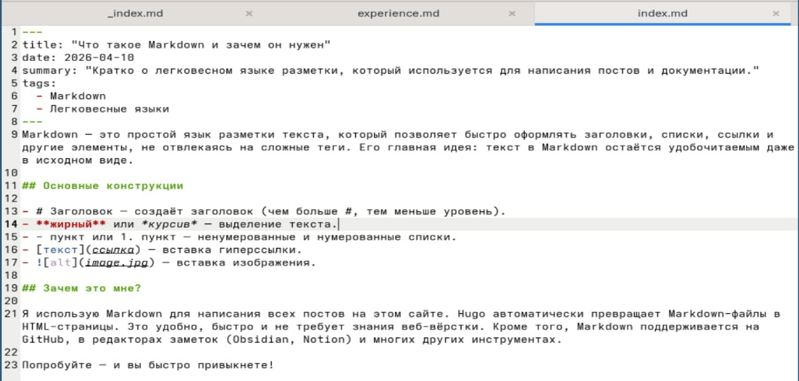

---
## Author
author:
  name: Валерия Сергеевна Григорьева
  degrees: DSc
  orcid: 0000-0002-0877-7063
  email: 1032253494@rudn.ru
  affiliation:
    - name: Российский университет дружбы народов
      country: Российская Федерация
      postal-code: 117198
      city: Москва
      address: ул. Миклухо-Маклая, д. 6

## Title
title: "Индивидуальный проект: этап 3"
subtitle: "дисциплина: Архитектура компьютера"
license: "CC BY"
---

# Цель работы

Целью работы было добавить к сайту достижения и опубликовать посты.

# Задание

1. Список достижений.

- Добавить информацию о навыках (Skills).

- Добавить информацию об опыте (Experience).

- Добавить информацию о достижениях (Accomplishments).

2. Сделать пост по прошедшей неделе.

3. Добавить пост на тему по выбору: легковесные языки разметки, LaTeX, язык разметки Markdown.

# Выполнение лабораторной работы

В начале работы я в папке data/authors в файле me.yaml и в файле _index.md добавила информацию о навыках, опыте и достижениях ([рис. @fig-001]).

{#fig-001 width=70%}

Затем в каталоге content/blog я добавила подкаталоги с новыми постами прошедшей неделе и о языке разметки Markdown ([рис. @fig-002]). 

{#fig-002 width=70%}

Далее я проверила, что все изменения применились, и собрала сайт с помощью команды hugo server. Сайт теперь содержит информацию обо мне и мои новые посты ([рис. @fig-003]). Затем я отправила зменения на гитхаб.

{#fig-003 width=70%}

# Выводы

В результате выполнения данного этапа индивидульного проекта я добавила на сайт информацию о своих достижениях и опубликовала посты.

# Список литературы{.unnumbered}

::: {#refs}
:::
